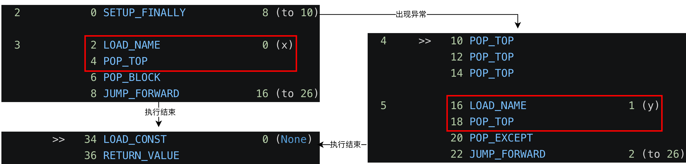
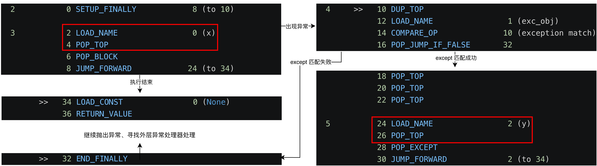
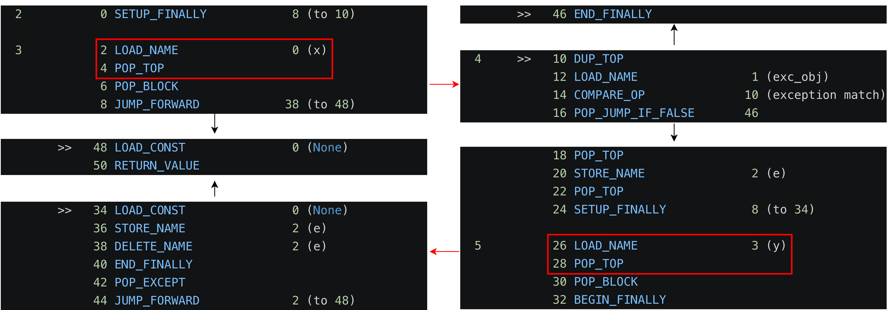
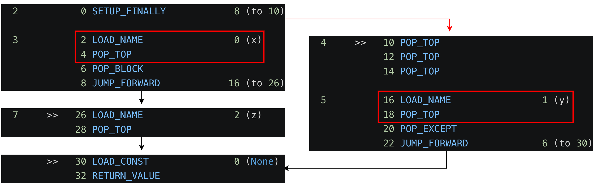
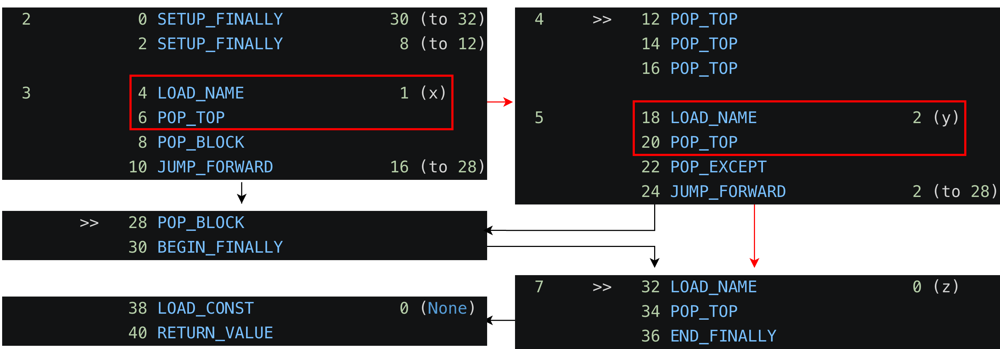

### 捕获异常

Python 提供 `try-except[-else][-finally]` 的语法供捕获和处理异常，完整语法规范如下所示：

* try 块内允许写任意 Python 代码，其间或内部都可能抛出异常。

* except 块用于匹配 try 块内可能触发的异常和定义相应异常的处理逻辑。异常处理逻辑也可能引发异常，因此也允许在 except 内继续嵌套 `try-except` 语法，否则异常会向上传播。

* 若 try 块内没有异常发生，则会执行 else 代码，反之则不执行。另外，其中抛出的异常只能由更外层 `try-except` 捕获和处理。

* 无论 try 块内异常发生与否，在 try 块的最后都会执行 finally 内的代码。与 else 类似，其中抛出的异常也由更外层的异常处理器捕获和处理。

```peg
try_stmt: 
    'try' ':' suite (
        ((except_clause ':' suite)+
        ['else' ':' suite]
        ['finally' ':' suite]) 
        | 'finally' ':' suite
    )

except_clause: 'except' [test ['as' NAME]]
```

Python 的输入一定是各种形式的 Python 程序，如代码片段或编译后的 @@codeobject@@ 对象，其最终都将转换为 @@frameobject@@ 的执行，即 @@CAPI_PyEval_EvalFrame@@ 函数的执行。总之，入口一定是 @@CAPI_PyEval_EvalFrame@@ 接口。若其执行期间出现异常，且找不到相应处理器，则类似传统错误处理，返回 *NULL* 表明出现错误，后续由接口调用方负责错误的处理。如 @@CAPI_PyRun_SimpleStringFlags@@ 接口（即 `python -c <command>` 输入方式）执行 Python 代码，若执行期间错误无法处理，则由 @@CAPI_PyErr_Print@@ 接口在控制台打印异常消息。

```c
// Python/pythonrun.c#PyRun_SimpleStringFlags
int
PyRun_SimpleStringFlags(const char *command, PyCompilerFlags *flags)
{
    PyObject *m, *d, *v;
    m = PyImport_AddModule("__main__");
    if (m == NULL)
        return -1;
    d = PyModule_GetDict(m);
    v = PyRun_StringFlags(command, Py_file_input, d, d, flags);
    if (v == NULL) {
        PyErr_Print();
        return -1;
    }
    Py_DECREF(v);
    return 0;
}

/* PyRun_StringFlags() -> run_mod() -> run_eval_code_obj() */

// Python/pythonrun.c#run_eval_code_obj
static PyObject *
run_eval_code_obj(PyCodeObject *co, PyObject *globals, PyObject *locals)
{
    PyObject *v;
    /*
     * We explicitly re-initialize _Py_UnhandledKeyboardInterrupt every eval
     * _just in case_ someone is calling into an embedded Python where they
     * don't care about an uncaught KeyboardInterrupt exception (why didn't they
     * leave config.install_signal_handlers set to 0?!?) but then later call
     * Py_Main() itself (which _checks_ this flag and dies with a signal after
     * its interpreter exits).  We don't want a previous embedded interpreter's
     * uncaught exception to trigger an unexplained signal exit from a future
     * Py_Main() based one.
     */
    _Py_UnhandledKeyboardInterrupt = 0;

    /* Set globals['__builtins__'] if it doesn't exist */
    if (globals != NULL && PyDict_GetItemString(globals, "__builtins__") == NULL) {
        PyInterpreterState *interp = _PyInterpreterState_Get();
        if (PyDict_SetItemString(globals, "__builtins__", interp->builtins) < 0) {
            return NULL;
        }
    }

    v = PyEval_EvalCode((PyObject*)co, globals, locals);
    if (!v && PyErr_Occurred() == PyExc_KeyboardInterrupt) {
        _Py_UnhandledKeyboardInterrupt = 1;
    }
    return v;
}
```

`try-except` 语句属于 Python 语法，那么一定是在 @@CAPI_PyEval_EvalFrame@@ 内部实现，即捕获和处理其它字节码执行期间抛出的异常，包括 C 层抛出的或 Python 层面抛出的。因为入口是 @@CAPI_PyEval_EvalFrame@@ 接口，只有与字节码执行关联的 C 代码抛出的异常才能被捕获。下面先分析不同形式 `try-except` 的字节码执行流：

* 进入 try 时，由 @@SETUP_FINALLY@@ 设置异常处理器。然后执行用户代码，即 x 部分，其间可能抛出异常。

    * 若正常执行，因为 except 块不会再执行，则由 @@POP_BLOCK@@ 弹出异常处理器，并跳转到 except 后执行。
    
    * 若发生异常，匹配的异常处理器会跳转到第 *10* 偏移字节码执行异常处理，即 y 部分，其间也可能抛出异常，若出现异常，则会因为没有异常处理器中断字节码的执行，将异常传播到更上层调用者。

    * 若 except 正常执行，则最后还有一个 @@POP_EXCEPT@@ 字节码。其负责将正在处理的异常恢复为上层 except 处理的异常，因为 except 允许嵌套 `try-except`。若 except 内出现异常，被捕获处理后，退出到外层 except 时需要将正在处理的异常恢复为外层异常。此外，还负责弹出一个隐式的异常处理器。因为若 except 内出现异常，且没有嵌套的 `try-except` 处理异常，则需要一个隐式的异常处理器来清理 except 执行期间的值栈，然后再向上抛出异常。

    * 注意到，第 *24* 偏移字节码不可达。因为该例中的 except 匹配所有异常，不会出现匹配失败的情况。

```python
>>> dis("""
... try:
...     x
... except:
...     y
... """)
  2           0 SETUP_FINALLY            8 (to 10)

  3           2 LOAD_NAME                0 (x)
              4 POP_TOP
              6 POP_BLOCK
              8 JUMP_FORWARD            16 (to 26)

  4     >>   10 POP_TOP
             12 POP_TOP
             14 POP_TOP

  5          16 LOAD_NAME                1 (y)
             18 POP_TOP
             20 POP_EXCEPT
             22 JUMP_FORWARD             2 (to 26)
             24 END_FINALLY
        >>   26 LOAD_CONST               0 (None)
             28 RETURN_VALUE
```


<p align="center"><em>对应上述字节码可能的执行流，红框标注部分为可能触发异常的字节码。</em></p>

* 如下例子中，except 只会在异常匹配时才进入相应处理器。

    * 匹配异常时，会先由 @@DUP_TOP@@ 字节码将栈顶元素再次入栈。其在进入进入异常处理器代码前，会将正在被处理的异常回溯、异常对象和异常类型依次入栈，复制栈顶的异常类型用于异常比较。

    * 那么当异常不匹配时，则跳转到 @@END_FINALLY@@ 处执行，其会重新抛出异常，即将异常设置到 @@PyThreadState@@ 的 curexc_* 字段，然后向上寻找异常处理器处理异常。注意到，此时已经进入 SETUP_FINALLY(10) 异常处理器，上述提到，其间会隐式创建一个异常处理器，那么第一个寻找到的异常处理器即该隐式异常处理器。

```python
>>> dis("""
... try:
...     x
... except exc_obj:
...     y
... """)
  2           0 SETUP_FINALLY            8 (to 10)

  3           2 LOAD_NAME                0 (x)
              4 POP_TOP
              6 POP_BLOCK
              8 JUMP_FORWARD            24 (to 34)

  4     >>   10 DUP_TOP
             12 LOAD_NAME                1 (exc_obj)
             14 COMPARE_OP              10 (exception match)
             16 POP_JUMP_IF_FALSE       32
             18 POP_TOP
             20 POP_TOP
             22 POP_TOP

  5          24 LOAD_NAME                2 (y)
             26 POP_TOP
             28 POP_EXCEPT
             30 JUMP_FORWARD             2 (to 34)
        >>   32 END_FINALLY
        >>   34 LOAD_CONST               0 (None)
             36 RETURN_VALUE
```



* 在匹配异常的基础上接收异常对象，即在 except 匹配成功后，将栈中的异常对象设置到局部变量 *e* 中。

    * 在进入 except 中 y 部分的执行前，还会再设置一个异常处理器 SETUP_FINALLY(34)。其目的是在 except 退出后，将局部变量 *e* 进行清理，即类似隐含的 `try-finally` 语句。设置为异常处理器的原因是 y 部分可能抛出无法处理的异常，那么又会寻找异常处理器处理异常，此时首先寻找到 SETUP_FINALLY(34)，其跳转到 *34* 偏移开始执行清理，清理后 *40* 偏移的 @@END_FINALLY@@ 又会将异常重新抛出，接着的是 SETUP_FINALLY(34) 和 SETUP_FINALLY(10) 隐式设置的异常处理器清理值栈。

    * 对于 except 正常执行的情况，*30* 偏移的 @@POP_BLOCK@@ 首先弹出 SETUP_FINALLY(34) 异常处理器。然后进入异常局部变量的清理，@@BEGIN_FINALLY@@ 会将 *NULL* 压入值栈，配合后续的 @@END_FINALLY@@ 知道此时属于正常流程，无需抛出异常，然后由 @@POP_EXCEPT@@ 弹出 SETUP_FINALLY(10) 隐士设置的异常处理器。

```python
>>> dis("""
... try:
...     x
... except exc_obj as e:
...     y
... """)
  2           0 SETUP_FINALLY            8 (to 10)

  3           2 LOAD_NAME                0 (x)
              4 POP_TOP
              6 POP_BLOCK
              8 JUMP_FORWARD            38 (to 48)

  4     >>   10 DUP_TOP
             12 LOAD_NAME                1 (exc_obj)
             14 COMPARE_OP              10 (exception match)
             16 POP_JUMP_IF_FALSE       46
             18 POP_TOP
             20 STORE_NAME               2 (e)
             22 POP_TOP
             24 SETUP_FINALLY            8 (to 34)

  5          26 LOAD_NAME                3 (y)
             28 POP_TOP
             30 POP_BLOCK
             32 BEGIN_FINALLY
        >>   34 LOAD_CONST               0 (None)
             36 STORE_NAME               2 (e)
             38 DELETE_NAME              2 (e)
             40 END_FINALLY
             42 POP_EXCEPT
             44 JUMP_FORWARD             2 (to 48)
        >>   46 END_FINALLY
        >>   48 LOAD_CONST               0 (None)
             50 RETURN_VALUE
```


<p align="center"><em>省略与上述相似的箭头文本描述，红色箭头表示出现异常时的流向。</em></p>

* 对于带 else 的情况，其会在 try 未抛出异常的情况下，继续执行 else 部分的代码。该部分也可能抛出异常，由其内部或更上层定义的异常处理器处理。当进入 except 的情况，在其执行结束后会跳过 else 的部分。

```python
>>> dis("""
... try:
...     x
... except:
...     y
... else:
...     z
... """)
  2           0 SETUP_FINALLY            8 (to 10)

  3           2 LOAD_NAME                0 (x)
              4 POP_TOP
              6 POP_BLOCK
              8 JUMP_FORWARD            16 (to 26)

  4     >>   10 POP_TOP
             12 POP_TOP
             14 POP_TOP

  5          16 LOAD_NAME                1 (y)
             18 POP_TOP
             20 POP_EXCEPT
             22 JUMP_FORWARD             6 (to 30)
             24 END_FINALLY

  7     >>   26 LOAD_NAME                2 (z)
             28 POP_TOP
        >>   30 LOAD_CONST               0 (None)
             32 RETURN_VALUE
>>> 
```



* 对于有 finally 的情况，其代码无论在 try 或 except 部分是否抛出异常都需执行到。在 try 的开始，会依次入栈两个异常处理器，先是 finally 对应的异常处理器 SETUP_FINALLY(32)，然后是 except 对应的异常处理器 SETUP_FINALLY(12)。

    * 若 except 内抛出未捕获异常，先由其隐式设置的异常处理器清理值栈。然后由 SETUP_FINALLY(32) 异常处理器跳转到 *32* 偏移位置执行 finally 代码。若正常执行，那么 *36* 偏移的 @@END_FINALLY@@ 会将 y 抛出的异常重新抛出，接着由 SETUP_FINALLY(32) 隐式设置的异常处理器清理值栈，然后继续寻找异常处理器或向上抛出。

    * 对于 except 正常执行的情况，与执行流与接收异常对象的情况类似。

    * z 部分也可能抛出异常，此时先由 SETUP_FINALLY(32) 隐式设置的异常处理器清理值栈，然后寻找其它异常处理器或向上抛出。

```python
>>> dis("""
... try:
...     x
... except:
...     y
... finally:
...     z
... """)
  2           0 SETUP_FINALLY           30 (to 32)
              2 SETUP_FINALLY            8 (to 12)

  3           4 LOAD_NAME                1 (x)
              6 POP_TOP
              8 POP_BLOCK
             10 JUMP_FORWARD            16 (to 28)

  4     >>   12 POP_TOP
             14 POP_TOP
             16 POP_TOP

  5          18 LOAD_NAME                2 (y)
             20 POP_TOP
             22 POP_EXCEPT
             24 JUMP_FORWARD             2 (to 28)
             26 END_FINALLY
        >>   28 POP_BLOCK
             30 BEGIN_FINALLY

  7     >>   32 LOAD_NAME                0 (z)
             34 POP_TOP
             36 END_FINALLY
             38 LOAD_CONST               0 (None)
             40 RETURN_VALUE
```



* 此外，还有更复杂的例子，其综合了上述分析的各个部分，以及 `try-finally` 的原子情形，其与 `try-except` 类似，此处不再分析。

```python
>>> dis("""
... try:
...     x
... except exc_obj1 as a:
...     try:
...         y
...     except:
...         z
... except exc_obj2 as b:
...     u
... else:
...     v
... finally:
...     w
... """)
  2           0 SETUP_FINALLY          114 (to 116)
              2 SETUP_FINALLY            8 (to 12)

  3           4 LOAD_NAME                1 (x)
              6 POP_TOP
              8 POP_BLOCK
             10 JUMP_FORWARD            96 (to 108)

  4     >>   12 DUP_TOP
             14 LOAD_NAME                2 (exc_obj1)
             16 COMPARE_OP              10 (exception match)
             18 POP_JUMP_IF_FALSE       70
             20 POP_TOP
             22 STORE_NAME               3 (a)
             24 POP_TOP
             26 SETUP_FINALLY           30 (to 58)

  5          28 SETUP_FINALLY            8 (to 38)

  6          30 LOAD_NAME                4 (y)
             32 POP_TOP
             34 POP_BLOCK
             36 JUMP_FORWARD            16 (to 54)

  7     >>   38 POP_TOP
             40 POP_TOP
             42 POP_TOP

  8          44 LOAD_NAME                5 (z)
             46 POP_TOP
             48 POP_EXCEPT
             50 JUMP_FORWARD             2 (to 54)
             52 END_FINALLY
        >>   54 POP_BLOCK
             56 BEGIN_FINALLY
        >>   58 LOAD_CONST               0 (None)
             60 STORE_NAME               3 (a)
             62 DELETE_NAME              3 (a)
             64 END_FINALLY
             66 POP_EXCEPT
             68 JUMP_FORWARD            42 (to 112)

  9     >>   70 DUP_TOP
             72 LOAD_NAME                6 (exc_obj2)
             74 COMPARE_OP              10 (exception match)
             76 POP_JUMP_IF_FALSE      106
             78 POP_TOP
             80 STORE_NAME               7 (b)
             82 POP_TOP
             84 SETUP_FINALLY            8 (to 94)

 10          86 LOAD_NAME                8 (u)
             88 POP_TOP
             90 POP_BLOCK
             92 BEGIN_FINALLY
        >>   94 LOAD_CONST               0 (None)
             96 STORE_NAME               7 (b)
             98 DELETE_NAME              7 (b)
            100 END_FINALLY
            102 POP_EXCEPT
            104 JUMP_FORWARD             6 (to 112)
        >>  106 END_FINALLY

 12     >>  108 LOAD_NAME                9 (v)
            110 POP_TOP
        >>  112 POP_BLOCK
            114 BEGIN_FINALLY

 14     >>  116 LOAD_NAME                0 (w)
            118 POP_TOP
            120 END_FINALLY
            122 LOAD_CONST               0 (None)
            124 RETURN_VALUE

>>> dis("""
... try:
...     x
... finally:
...     y
... """)
  2           0 SETUP_FINALLY            8 (to 10)

  3           2 LOAD_NAME                1 (x)
              4 POP_TOP
              6 POP_BLOCK
              8 BEGIN_FINALLY

  5     >>   10 LOAD_NAME                0 (y)
             12 POP_TOP
             14 END_FINALLY
             16 LOAD_CONST               0 (None)
             18 RETURN_VALUE
```

总体上，@@CAPI_PyEval_EvalFrame@@ 内部的异常处理机制设计如下：

* 若字节码检测到错误，一般是函数调用出现 *NULL* 返回值时，直接跳转到 error 或 exception_unwind 处进行异常处理。

* @@frameobject@@ 内维护一个 *f_blockstack* 块处理器栈，异常处理器是其中之一。在上述例子中，对于 except 或 finally 会都由 @@SETUP_FINALLY@@ 字节码入栈异常处理器，其中记录了异常处理逻辑的字节码偏移和值栈深度。

* error 部分会先检查异常是否正确抛出，然后由 @@CAPI_PyTraceBack_Here@@ 为异常对象计算 \_\_traceback__ 属性，并设置到 @@PyThreadState@@ 的 *curexc_traceback* 字段。

* exception_unwind 部分即逐个出栈 *f_blockstack* 中的处理器来处理异常，即利用后入栈先匹配和异常处理器的出栈入栈是成对的逻辑。

    * 如异常处理器是 EXCEPT_HANDLER(-1) 类型，即 SETUP_FINALLY(i) 隐式设置的异常处理器，则由 UNWIND_EXCEPT_HANDLER() 恢复值栈的深度，并将正在处理器的异常恢复为上层 except 处理的异常，其异常标记是在进入当前层 except 处理器时，压入值栈的。

    * 如异常处理器是 SETUP_FINALLY(i) 类型，即 except 或 finally 的异常处理器。先恢复值栈，即清理执行 try 块的值栈。然后将正在处理的异常 *exc_info* 压入值栈，以便于当前异常处理器退出时恢复。进一步将正在传播的异常取出，并设置到 *exc_info* 和压入值栈表明正在处理的异常。最后将字节码取值偏移修改为异常处理器代码偏移，进入 main_loop 执行异常处理程序。

* try 块正常执行的情况，执行的最后会对应 @@POP_BLOCK@@ 弹出 @@BEGIN_FINALLY@@ 设置的异常处理器。

* 进入 except 且正常执行的情况，则需要 @@POP_EXCEPT@@ 弹出 EXCEPT_HANDLER(-1) 处理器和恢复上层异常标记。

* 两个处理器正常接续执行的情况，如 except 后接着执行 finally 或 try 后接着执行 finally 等，则需要 @@BEGIN_FINALLY@@ 标记块是正常进入的，即向值栈压入 *NULL* 作为标记来表明。

* @@END_FINALLY@@ 具有多重功能，

    * 若栈顶为 *NULL*，表明是正常情况进入处理器的，则什么也不做。
    
    * 否则可能是 except 找不到匹配的异常处理器，则跳转到 @@END_FINALLY@@ 继续将当前处理的异常抛出。此时，尽管 *exc_info* 同样记录了相同的正在处理器的异常，但其第一个遇到异常处理器一定是 EXCEPT_HANDLER(-1)，其会将当前异常恢复为更上一层正在处理的异常。情况就类似当前异常正在传播，但还未被任何处理器处理，但已经弹出当前层的异常处理器，需寻找更上层异常处理器处理。

    * 也可能是处理器以异常的形式进入，但该处理器无法处理异常，如 except 引发新异常后进入 finally，则由于 SETUP_FINALLY(i) 进入之前已经将传播的异常压入栈，在执行完 finally 后，只需重新抛出异常即可。

* 注意到，当异常找不到异常处理器处理时，即 *f_blockstack* 为空时，此时就会退出字节码执行的循环，清理 @@frameobject@@ 执行期间的栈，然后返回 *NULL* 退出 @@CAPI_PyEval_EvalFrame@@ 函数，将异常交由更外层的函数处理。如一开始提到，入口一定会是 @@CAPI_PyEval_EvalFrame@@，那么无论递归多少层，若都找不到异常处理器，则逐级回退到 @@CAPI_PyEval_EvalFrame@@ 外的函数。同时，如函数等代码块的执行会绑定新的 @@frameobject@@ 来执行，因此函数内抛出的异常可向上传播到外面的 @@frameobject@@，最终到可以到调用第一层 @@CAPI_PyEval_EvalFrame@@ 函数的函数。

```c
// Python/ceval.c#_PyEval_EvalFrameDefault
PyObject* _Py_HOT_FUNCTION
_PyEval_EvalFrameDefault(PyFrameObject *f, int throwflag)
{

/* 初始化 */

/* macros for block handling */

#define UNWIND_BLOCK(b) \
    while (STACK_LEVEL() > (b)->b_level) { \
        PyObject *v = POP(); \
        Py_XDECREF(v); \
    }

#define UNWIND_EXCEPT_HANDLER(b) \
    do { \
        PyObject *type, *value, *traceback; \
        _PyErr_StackItem *exc_info; \
        assert(STACK_LEVEL() >= (b)->b_level + 3); \
        while (STACK_LEVEL() > (b)->b_level + 3) { \
            value = POP(); \
            Py_XDECREF(value); \
        } \
        /* 当前 except 处理的异常信息 */ \
        exc_info = tstate->exc_info; \
        type = exc_info->exc_type; \
        value = exc_info->exc_value; \
        traceback = exc_info->exc_traceback; \
        /* 退回上一层 except 的异常信息 */ \
        exc_info->exc_type = POP(); \
        exc_info->exc_value = POP(); \
        exc_info->exc_traceback = POP(); \
        Py_XDECREF(type); \
        Py_XDECREF(value); \
        Py_XDECREF(traceback); \
    } while(0)

/* 初始化 */

if (throwflag) /* support for generator.throw() */
    goto error;
    
main_loop:
    for (;;) {
        /* 信号处理、取指 */
        switch (opcode) {

        /* 字节码 */
        
        case TARGET(BINARY_TRUE_DIVIDE): {
            PyObject *divisor = POP();
            PyObject *dividend = TOP();
            PyObject *quotient = PyNumber_TrueDivide(dividend, divisor);
            Py_DECREF(dividend);
            Py_DECREF(divisor);
            SET_TOP(quotient);
            if (quotient == NULL)
                goto error;  // 出现异常，跳转到错误处理
            DISPATCH();
        }

        case TARGET(SETUP_FINALLY): {
            /* NOTE: If you add any new block-setup opcodes that
               are not try/except/finally handlers, you may need
               to update the PyGen_NeedsFinalizing() function.
               */

            PyFrame_BlockSetup(f, SETUP_FINALLY, INSTR_OFFSET() + oparg,
                               STACK_LEVEL());
            DISPATCH();
        }

        case TARGET(POP_BLOCK): {
            PREDICTED(POP_BLOCK);
            PyFrame_BlockPop(f);
            DISPATCH();
        }

        case TARGET(POP_EXCEPT): {
            // 退出本层 except 块
            PyObject *type, *value, *traceback;
            _PyErr_StackItem *exc_info;
            PyTryBlock *b = PyFrame_BlockPop(f);
            if (b->b_type != EXCEPT_HANDLER) {  
                // 进入 SET_FINALLY 处理器时隐式设置的
                _PyErr_SetString(tstate, PyExc_SystemError,
                                 "popped block is not an except handler");
                goto error;
            }
            // 3 个旧的异常信息
            assert(STACK_LEVEL() >= (b)->b_level + 3 &&
                   STACK_LEVEL() <= (b)->b_level + 4);
            exc_info = tstate->exc_info;  // 本层 except 块处理的异常
            type = exc_info->exc_type;
            value = exc_info->exc_value;
            traceback = exc_info->exc_traceback;
            // 恢复旧的异常信息，供上层 except 处理
            exc_info->exc_type = POP();
            exc_info->exc_value = POP();
            exc_info->exc_traceback = POP();
            Py_XDECREF(type);
            Py_XDECREF(value);
            Py_XDECREF(traceback);
            DISPATCH();
        }

        case TARGET(BEGIN_FINALLY): {
            /* Push NULL onto the stack for using it in END_FINALLY,
               POP_FINALLY, WITH_CLEANUP_START and WITH_CLEANUP_FINISH.
             */
            PUSH(NULL);
            FAST_DISPATCH();
        }

        case TARGET(END_FINALLY): {
            PREDICTED(END_FINALLY);
            /* At the top of the stack are 1 or 6 values:
               Either:
                - TOP = NULL or an integer
               or:
                - (TOP, SECOND, THIRD) = exc_info()
                - (FOURTH, FITH, SIXTH) = previous exception for EXCEPT_HANDLER
            */
            PyObject *exc = POP();
            if (exc == NULL) {
                // 正常退出 SET_FINALLY 块
                FAST_DISPATCH();
            }
            else if (PyLong_CheckExact(exc)) {
                int ret = _PyLong_AsInt(exc);
                Py_DECREF(exc);
                if (ret == -1 && _PyErr_Occurred(tstate)) {
                    goto error;
                }
                JUMPTO(ret);
                FAST_DISPATCH();
            }
            else {
                // except 匹配失败，继续传播异常
                assert(PyExceptionClass_Check(exc));
                PyObject *val = POP();
                PyObject *tb = POP();
                _PyErr_Restore(tstate, exc, val, tb);
                goto exception_unwind;
            }
        }

        /* 字节码 */

        } /* switch */

        /* This should never be reached. Every opcode should end with DISPATCH()
           or goto error. */
        Py_UNREACHABLE();

error:
        /* Double-check exception status. */
        assert(_PyErr_Occurred(tstate));

        /* Log traceback info. */
        PyTraceBack_Here(f);

exception_unwind:
        /* Unwind stacks if an exception occurred */
        while (f->f_iblock > 0) {
            /* Pop the current block. */
            PyTryBlock *b = &f->f_blockstack[--f->f_iblock];

            if (b->b_type == EXCEPT_HANDLER) {
                // except 内出现异常，恢复栈状态，继续传播异常
                UNWIND_EXCEPT_HANDLER(b);
                continue;
            }
            UNWIND_BLOCK(b);  // 恢复栈深为 b->b_level
            if (b->b_type == SETUP_FINALLY) {
                PyObject *exc, *val, *tb;
                int handler = b->b_handler;
                _PyErr_StackItem *exc_info = tstate->exc_info;
                /* Beware, this invalidates all b->b_* fields */
                PyFrame_BlockSetup(f, EXCEPT_HANDLER, -1, STACK_LEVEL());
                PUSH(exc_info->exc_traceback);
                PUSH(exc_info->exc_value);
                if (exc_info->exc_type != NULL) {
                    PUSH(exc_info->exc_type);
                }
                else {
                    Py_INCREF(Py_None);
                    PUSH(Py_None);
                }
                // 获取需抛出的异常信息
                _PyErr_Fetch(tstate, &exc, &val, &tb);
                /* Make the raw exception data
                   available to the handler,
                   so a program can emulate the
                   Python main loop. */
                _PyErr_NormalizeException(tstate, &exc, &val, &tb);
                if (tb != NULL)  
                    // val.__traceback__ = tb
                    PyException_SetTraceback(val, tb);
                else
                    PyException_SetTraceback(val, Py_None);
                Py_INCREF(exc);
                exc_info->exc_type = exc;
                Py_INCREF(val);
                exc_info->exc_value = val;
                exc_info->exc_traceback = tb;
                if (tb == NULL)
                    tb = Py_None;
                Py_INCREF(tb);
                PUSH(tb);
                PUSH(val);
                PUSH(exc);
                JUMPTO(handler);  // 跳转到异常处理程序
                /* Resume normal execution */
                goto main_loop;
            }
        } /* unwind stack */

        /* End the loop as we still have an error */
        break;
    } /* main loop */

exit_returning:

    /* Pop remaining stack entries. */
    while (!EMPTY()) {
        PyObject *o = POP();
        Py_XDECREF(o);
    }

exit_yielding:
    /* tracing、profile */

    /* pop frame */
exit_eval_frame:
    if (PyDTrace_FUNCTION_RETURN_ENABLED())
        dtrace_function_return(f);
    Py_LeaveRecursiveCall();
    f->f_executing = 0;
    tstate->frame = f->f_back;

    return _Py_CheckFunctionResult(NULL, retval, "PyEval_EvalFrameEx");
}

// Objects/frameobject.c#PyFrame_BlockSetup
void
PyFrame_BlockSetup(PyFrameObject *f, int type, int handler, int level)
{
    PyTryBlock *b;
    if (f->f_iblock >= CO_MAXBLOCKS)
        Py_FatalError("XXX block stack overflow");
    b = &f->f_blockstack[f->f_iblock++];
    b->b_type = type;        // 块类型
    b->b_level = level;      // 块执行前栈深
    b->b_handler = handler;  // 块处理程序
}

// Objects/frameobject.c#PyFrame_BlockPop
PyTryBlock *
PyFrame_BlockPop(PyFrameObject *f)
{
    PyTryBlock *b;
    if (f->f_iblock <= 0)
        Py_FatalError("XXX block stack underflow");
    b = &f->f_blockstack[--f->f_iblock];
    return b;
}
```
