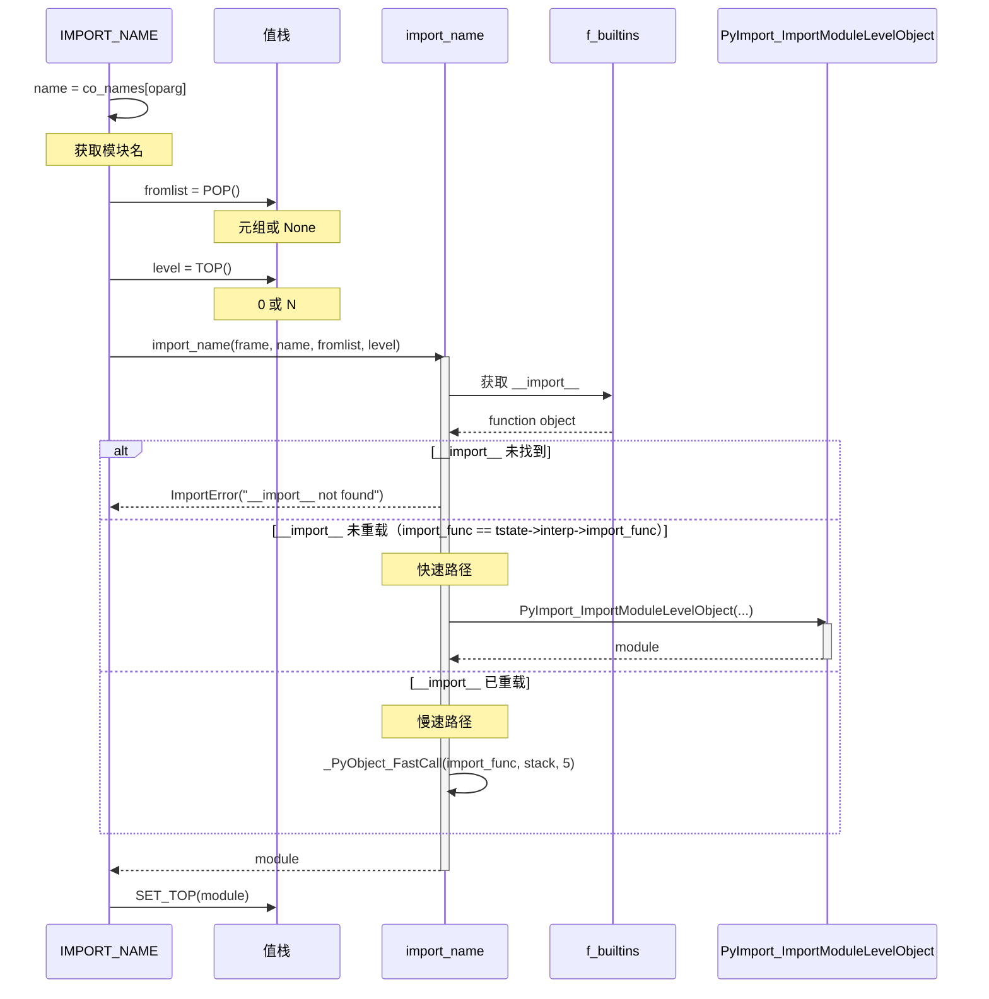
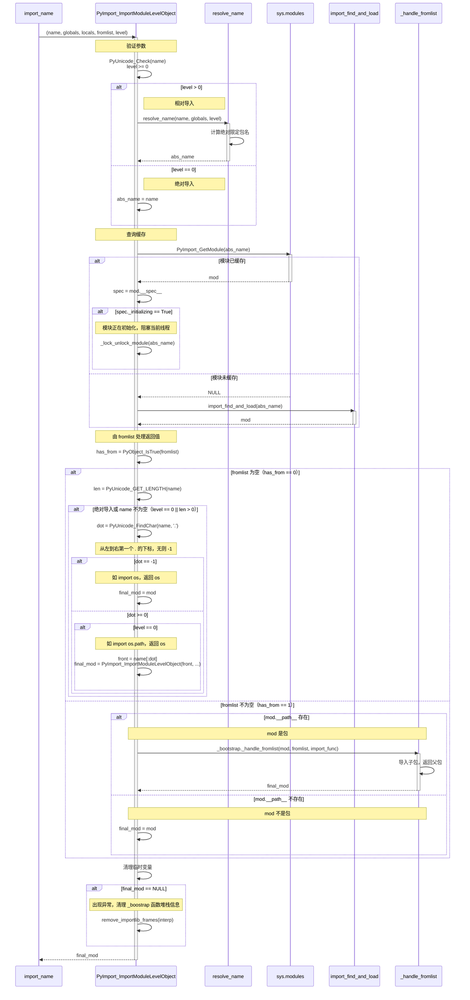
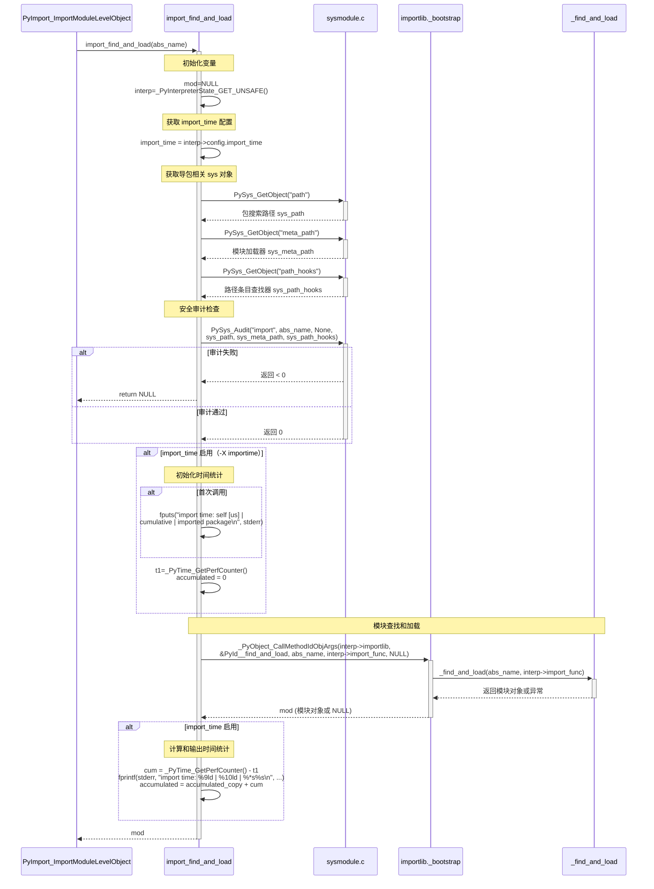
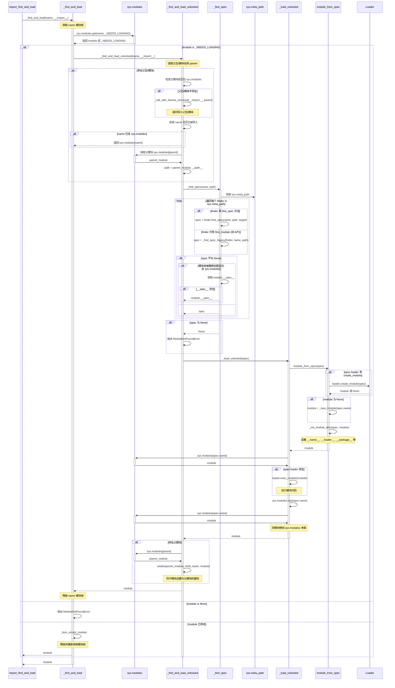

## import 是如何工作的？

通常的导入具有如下几种语法，一种是直接导入，另一种是相对导入。导入时也可以只导入指定子模块或包，也可以导入定义在 `__all__` 中的全部模块。

```python
>>> dis("import a")
  1           0 LOAD_CONST               0 (0)
              2 LOAD_CONST               1 (None)
              4 IMPORT_NAME              0 (a)
              6 STORE_NAME               0 (a)
              8 LOAD_CONST               1 (None)
             10 RETURN_VALUE

>>> dis("from a.b.c.d import e")
  1           0 LOAD_CONST               0 (0)
              2 LOAD_CONST               1 (('e',))
              4 IMPORT_NAME              0 (a.b.c.d)
              6 IMPORT_FROM              1 (e)
              8 STORE_NAME               1 (e)
             10 POP_TOP
             12 LOAD_CONST               2 (None)
             14 RETURN_VALUE

>>> dis("from a import *")
  1           0 LOAD_CONST               0 (0)
              2 LOAD_CONST               1 (('*',))
              4 IMPORT_NAME              0 (a)
              6 IMPORT_STAR
              8 LOAD_CONST               2 (None)
             10 RETURN_VALUE

>>> dis("from .... import b, c, d")
  1           0 LOAD_CONST               0 (4)
              2 LOAD_CONST               1 (('b', 'c', 'd'))
              4 IMPORT_NAME              0
              6 IMPORT_FROM              1 (b)
              8 STORE_NAME               1 (b)
             10 IMPORT_FROM              2 (c)
             12 STORE_NAME               2 (c)
             14 IMPORT_FROM              3 (d)
             16 STORE_NAME               3 (d)
             18 POP_TOP
             20 LOAD_CONST               2 (None)
             22 RETURN_VALUE

>>> dis("from ....a import b, c, d")
  1           0 LOAD_CONST               0 (4)
              2 LOAD_CONST               1 (('b', 'c', 'd'))
              4 IMPORT_NAME              0 (a)
              6 IMPORT_FROM              1 (b)
              8 STORE_NAME               1 (b)
             10 IMPORT_FROM              2 (c)
             12 STORE_NAME               2 (c)
             14 IMPORT_FROM              3 (d)
             16 STORE_NAME               3 (d)
             18 POP_TOP
             20 LOAD_CONST               2 (None)
             22 RETURN_VALUE
```

所有导入类型在字节码层面都可以用三组参数表示，分别为 name、fromlist 和 level。name 表示直接或间接导入的父包或模块（以下统称为父包），例如 `import a` 和 `from ....a import b, c, d` 中 name 为 `a`，而 `from .... import b, c, d` 中 name 为 `""`。fromlist 表示需要导入的子包或模块列表，通常为 from 后指定内容构成的 tuple。level 表示相对导入的层级，通常为 `.` 的个数，用于计算绝对包名。

这三组参数由两类字节码完成具体的导入操作，分别是 `IMPORT_NAME`、`IMPORT_FROM` 和 `IMPORT_STAR`。`IMPORT_NAME` 负责具体包或模块的导入，而 `IMPORT_FROM` 和 `IMPORT_STAR` 则配合 `STORE_NAME` 处理 fromlist 的赋值。

### 包或模块的导入

`IMPORT_NAME` 字节码接收上述三组参数，调用 `import_name` 函数导入包，然后将返回值压入值栈栈顶，以支持后续的赋值或 fromlist 的处理。

```c
// Python/ceval.c
PyObject* _Py_HOT_FUNCTION
_PyEval_EvalFrameDefault(PyFrameObject *f, int throwflag)
{
    int opcode;
main_loop:
    for (;;) {
        opcode = _Py_OPCODE(*next_instr);
        switch (opcode) {
            case TARGET(IMPORT_NAME): {
                PyObject *name = GETITEM(names, oparg);  // a.b.c.d
                PyObject *fromlist = POP();  // (e,)
                PyObject *level = TOP();  // 0
                PyObject *res;
                res = import_name(tstate, f, name, fromlist, level);
                Py_DECREF(level);
                Py_DECREF(fromlist);
                SET_TOP(res);
                if (res == NULL)
                    goto error;
                DISPATCH();
            }
        }
    }
}
```

`import_name` 作为字节码最顶层调用接口，该函数的功能为寻找参数列表形如 `(name, globals, locals, fromlist, level)` 的函数接口实现包的导入，默认情况下由 `PyImport_ImportModuleLevelObject` 函数实现。



`import_name` 作为字节码的最顶层调用接口，其功能是寻找参数列表形如 `(name, globals, locals, fromlist, level)` 的函数接口来实现包的导入，默认情况下由 `PyImport_ImportModuleLevelObject` 函数实现。

具体实现代码如下。其中 name 的可能取值包括 `"a"`、`""` 和 `"a.b.c.d"`。fromlist 的取值可以是 `None` 或 tuple。而 level 则为大于等于 `0` 的整数值。

```c
// Python/ceval.c
static PyObject *
import_name(PyThreadState *tstate, PyFrameObject *f,
            PyObject *name, PyObject *fromlist, PyObject *level)
// import_name(tstate, f, "a", None, 0)             <- import a
// import_name(tstate, f, "", ("b", "c", "d"), 4)   <- from .... import b, c, d
// import_name(tstate, f, "a", ("b", "c", "d"), 4)  <- from ....a import b, c, d
// import_name(tstate, f, "a.b.c.d", ("e",), 0)     <- from a.b.c.d import e
{
    _Py_IDENTIFIER(__import__);
    PyObject *import_func, *res;
    PyObject* stack[5];

    import_func = _PyDict_GetItemIdWithError(f->f_builtins, &PyId___import__);
    if (import_func == NULL) {
        if (!_PyErr_Occurred(tstate)) {
            _PyErr_SetString(tstate, PyExc_ImportError, "__import__ not found");
        }
        return NULL;
    }

    /* Fast path for not overloaded __import__. */
    // 解释器初始化时 import_func 赋值为 builtin.__import__
    if (import_func == tstate->interp->import_func) {
        int ilevel = _PyLong_AsInt(level);
        if (ilevel == -1 && _PyErr_Occurred(tstate)) {
            return NULL;
        }
        res = PyImport_ImportModuleLevelObject(
                        name,
                        f->f_globals,
                        f->f_locals == NULL ? Py_None : f->f_locals,
                        fromlist,
                        ilevel);
        return res;
    }

    Py_INCREF(import_func);

    // 自定义导入函数的，函数接口与 __import__ 一致
    stack[0] = name;
    stack[1] = f->f_globals;
    stack[2] = f->f_locals == NULL ? Py_None : f->f_locals;
    stack[3] = fromlist;
    stack[4] = level;
    res = _PyObject_FastCall(import_func, stack, 5);
    Py_DECREF(import_func);
    return res;
}
```

`PyImport_ImportModuleLevelObject` 函数完成父包和 fromlist 子包的导入，并返回合适的包以支持后续赋值。首先生成父包的绝对限定名，然后查询 `sys.modules` 缓存，若不存在则通过 `import_find_and_load(abs_name)` 进行导入，最后根据 fromlist 确定返回值。



`PyImport_ImportModuleLevelObject` 函数的实现如下，其中涉及的 `_PyObject_CallMethodIdObjArgs` 的具体函数调用由模块 `importlib._bootstrap` 实现。另外，由于 `importlib._bootstrap` 由 Python 实现，若导包过程出现错误，异常栈会包括其中函数帧的信息，因此 `remove_importlib_frames` 在出现异常时会去掉这些无关的信息。

```c
PyObject *
PyImport_ImportModuleLevelObject(PyObject *name, PyObject *globals,
                                 PyObject *locals, PyObject *fromlist,
                                 int level)
{
    _Py_IDENTIFIER(_handle_fromlist);
    PyObject *abs_name = NULL;
    PyObject *final_mod = NULL;
    PyObject *mod = NULL;
    PyObject *package = NULL;
    PyInterpreterState *interp = _PyInterpreterState_GET_UNSAFE();
    int has_from;

    if (name == NULL) {
        PyErr_SetString(PyExc_ValueError, "Empty module name");
        goto error;
    }

    /* The below code is importlib.__import__() & _gcd_import(), ported to C
       for added performance. */

    if (!PyUnicode_Check(name)) {
        PyErr_SetString(PyExc_TypeError, "module name must be a string");
        goto error;
    }
    if (PyUnicode_READY(name) < 0) {
        goto error;
    }
    if (level < 0) {
        PyErr_SetString(PyExc_ValueError, "level must be >= 0");
        goto error;
    }

    // 计算绝对包名或模块名
    if (level > 0) {  // .... | ....a
        abs_name = resolve_name(name, globals, level);
        if (abs_name == NULL)
            goto error;
    }
    else {  /* level == 0 */
        if (PyUnicode_GET_LENGTH(name) == 0) {
            PyErr_SetString(PyExc_ValueError, "Empty module name");
            goto error;
        }
        abs_name = name;
        Py_INCREF(abs_name);
    }

    // 从 sys.modules 缓存获取包
    mod = PyImport_GetModule(abs_name);
    if (mod == NULL && PyErr_Occurred()) {
        goto error;
    }

    // abs_name 存在缓存
    if (mod != NULL && mod != Py_None) {
        _Py_IDENTIFIER(__spec__);
        _Py_IDENTIFIER(_lock_unlock_module);
        PyObject *spec;

        /* Optimization: only call _bootstrap._lock_unlock_module() if
           __spec__._initializing is true.
           NOTE: because of this, initializing must be set *before*
           stuffing the new module in sys.modules.
         */
        // 初始化模块（__spec__._initializing == true）
        spec = _PyObject_GetAttrId(mod, &PyId___spec__);
        if (_PyModuleSpec_IsInitializing(spec)) {
            // _bootstrap._lock_unlock_module(abs_name)
            PyObject *value = _PyObject_CallMethodIdObjArgs(interp->importlib,
                                            &PyId__lock_unlock_module, abs_name,
                                            NULL);
            if (value == NULL) {
                Py_DECREF(spec);
                goto error;
            }
            Py_DECREF(value);
        }
        Py_XDECREF(spec);
    }
    // 第一次导入包 abs_name
    else {
        Py_XDECREF(mod);
        // 导入父包和当前包或模块
        mod = import_find_and_load(abs_name);
        if (mod == NULL) {
            goto error;
        }
    }

    has_from = 0;
    if (fromlist != NULL && fromlist != Py_None) {
        // 判断 tuple 是否为空
        has_from = PyObject_IsTrue(fromlist);
        if (has_from < 0)
            goto error;
    }
    // 不存在 fromlist
    if (!has_from) {
        Py_ssize_t len = PyUnicode_GET_LENGTH(name);
        // 存在 name 或顶级导入
        if (level == 0 || len > 0) {
            Py_ssize_t dot;

            dot = PyUnicode_FindChar(name, '.', 0, len, 1);
            if (dot == -2) {
                goto error;
            }

            // import os 情况，直接返回 os
            if (dot == -1) {
                /* No dot in module name, simple exit */
                final_mod = mod;
                Py_INCREF(mod);
                goto error;
            }

            // import os.path 情况，返回 os
            if (level == 0) {
                PyObject *front = PyUnicode_Substring(name, 0, dot);
                if (front == NULL) {
                    goto error;
                }

                final_mod = PyImport_ImportModuleLevelObject(front, NULL, NULL, NULL, 0);
                Py_DECREF(front);
            }
            // import .xxx 情况，其父包，实际情况不存在
            else {
                Py_ssize_t cut_off = len - dot;
                Py_ssize_t abs_name_len = PyUnicode_GET_LENGTH(abs_name);
                PyObject *to_return = PyUnicode_Substring(abs_name, 0,
                                                        abs_name_len - cut_off);
                if (to_return == NULL) {
                    goto error;
                }

                final_mod = PyImport_GetModule(to_return);
                Py_DECREF(to_return);
                if (final_mod == NULL) {
                    if (!PyErr_Occurred()) {
                        PyErr_Format(PyExc_KeyError,
                                     "%R not in sys.modules as expected",
                                     to_return);
                    }
                    goto error;
                }
            }
        }
        // 不存在 name 且相对导入，直接返回
        else {
            final_mod = mod;
            Py_INCREF(mod);
        }
    }
    // 存在 fromlist
    else {
        _Py_IDENTIFIER(__path__);
        PyObject *path;
        if (_PyObject_LookupAttrId(mod, &PyId___path__, &path) < 0) {
            goto error;
        }
        if (path) {
            Py_DECREF(path);
            // 导入 fromlist 子包
            // _boostrap._handle_fromlist(mod, fromlist, __import__)
            final_mod = _PyObject_CallMethodIdObjArgs(
                        interp->importlib, &PyId__handle_fromlist,
                        mod, fromlist, interp->import_func, NULL);
        }
        else {
            final_mod = mod;
            Py_INCREF(mod);
        }
    }

  error:
    Py_XDECREF(abs_name);
    Py_XDECREF(mod);
    Py_XDECREF(package);
    if (final_mod == NULL) {
        // 去除 _bootstrap 内部函数错误堆栈
        remove_importlib_frames(interp);
    }
    return final_mod;
}
```

在解释器启动时，会由 `init_importlib` 初始化与导入相关的字段。例如 `interp->importlib` 会初始化为 `_frozen_importlib`（即 `importlib._bootstrap`），而 `interp->import_func` 会初始化为 `__import__`。

作为核心组件之一的导入系统，其模块的导入方式有别于其它模块。相关模块的字节码二进制文件预先编译并存放在对应的头文件中，在虚拟机启动时由 `PyImport_ImportFrozenModule` 进行执行和加载。

```c
static const struct _frozen _PyImport_FrozenModules[] = {
    /* importlib */
    {"_frozen_importlib", _Py_M__importlib_bootstrap,
        (int)sizeof(_Py_M__importlib_bootstrap)},
    {"_frozen_importlib_external", _Py_M__importlib_bootstrap_external,
        (int)sizeof(_Py_M__importlib_bootstrap_external)},
    {"zipimport", _Py_M__zipimport,
        (int)sizeof(_Py_M__zipimport)},
    /* Test module */
    {"__hello__", M___hello__, SIZE},
    /* Test package (negative size indicates package-ness) */
    {"__phello__", M___hello__, -SIZE},
    {"__phello__.spam", M___hello__, SIZE},
    {0, 0, 0} /* sentinel */
};

static PyStatus
init_importlib(PyInterpreterState *interp, PyObject *sysmod)
{
    PyObject *importlib;
    PyObject *impmod;
    PyObject *value;
    int verbose = interp->config.verbose;

    /* Import _importlib through its frozen version, _frozen_importlib. */
    if (PyImport_ImportFrozenModule("_frozen_importlib") <= 0) {
        return _PyStatus_ERR("can't import _frozen_importlib");
    }
    else if (verbose) {
        PySys_FormatStderr("import _frozen_importlib # frozen\n");
    }
    importlib = PyImport_AddModule("_frozen_importlib");
    if (importlib == NULL) {
        return _PyStatus_ERR("couldn't get _frozen_importlib from sys.modules");
    }
    interp->importlib = importlib;
    Py_INCREF(interp->importlib);

    interp->import_func = PyDict_GetItemString(interp->builtins, "__import__");
    if (interp->import_func == NULL)
        return _PyStatus_ERR("__import__ not found");
    Py_INCREF(interp->import_func);

    /* Import the _imp module */
    impmod = PyInit__imp();
    if (impmod == NULL) {
        return _PyStatus_ERR("can't import _imp");
    }
    else if (verbose) {
        PySys_FormatStderr("import _imp # builtin\n");
    }
    if (_PyImport_SetModuleString("_imp", impmod) < 0) {
        return _PyStatus_ERR("can't save _imp to sys.modules");
    }

    /* Install importlib as the implementation of import */
    value = PyObject_CallMethod(importlib, "_install", "OO", sysmod, impmod);
    if (value == NULL) {
        PyErr_Print();
        return _PyStatus_ERR("importlib install failed");
    }
    Py_DECREF(value);
    Py_DECREF(impmod);

    return _PyStatus_OK();
}
```

### PyImport_ImportModuleLevelObject 函数实现细节

相对导入需要生成绝对限定包名，由函数 `resolve_name` 完成，它依赖调用帧所在 globals 中的 `__package__`、`__spec__` 和 `__name__` 等属性来确定。具体而言，`__package__` 记录了模块所属包的绝对限定名，除了最顶级包为 "" 和 `__main__` 模块为 `None` 之外，其它包都应该存在该属性。`__spec__` 为模块规格说明信息，其 parent 字段记录了 `__package__`。`__name__` 为模块的完整限定名，通常为 `"<__package__>.<mod_name>"`。

基于 globals 中的信息获取包名 package：若存在 `__package__`，则 `package = __package__` 并由 `__spec__` 进行验证；否则从 `__spec__` 中获取，即 `package = __spec__.parent`；若都不存在，则从限定名 `__name__` 中提取 package。

获得 package 后，根据 level 进行回退和检查，确定目标导入模块的包名。若为 `from . import xxx` 方式导入，则直接返回 `package`；若为 `from .abc import xxx` 方式，则返回 `<package>.abc`。

```c
// Python/import.c
static PyObject *
resolve_name(PyObject *name, PyObject *globals, int level)
// resolve_name("", globals, 4)     <- from .... import b, c, d
// resolve_name("a", globals, 4)    <- from ....a import b, c, d
{
    _Py_IDENTIFIER(__spec__);
    _Py_IDENTIFIER(__package__);
    _Py_IDENTIFIER(__path__);
    _Py_IDENTIFIER(__name__);
    _Py_IDENTIFIER(parent);
    PyObject *abs_name;
    PyObject *package = NULL;
    PyObject *spec;
    Py_ssize_t last_dot;
    PyObject *base;
    int level_up;

    if (globals == NULL) {
        PyErr_SetString(PyExc_KeyError, "'__name__' not in globals");
        goto error;
    }
    if (!PyDict_Check(globals)) {
        PyErr_SetString(PyExc_TypeError, "globals must be a dict");
        goto error;
    }
    // package 记录模块所属的绝对包名，最顶级模块或 __main__ 模块包名为 ""
    package = _PyDict_GetItemIdWithError(globals, &PyId___package__);
    if (package == Py_None) {
        package = NULL;
    }
    else if (package == NULL && PyErr_Occurred()) {
        goto error;
    }
    spec = _PyDict_GetItemIdWithError(globals, &PyId___spec__);
    if (spec == NULL && PyErr_Occurred()) {
        goto error;
    }

    // 存在 __package__, package = __package__
    if (package != NULL) {
        Py_INCREF(package);
        if (!PyUnicode_Check(package)) {
            PyErr_SetString(PyExc_TypeError, "package must be a string");
            goto error;
        }
        else if (spec != NULL && spec != Py_None) {
            int equal;
            PyObject *parent = _PyObject_GetAttrId(spec, &PyId_parent);
            if (parent == NULL) {
                goto error;
            }

            equal = PyObject_RichCompareBool(package, parent, Py_EQ);
            Py_DECREF(parent);
            if (equal < 0) {
                goto error;
            }
            else if (equal == 0) {
                if (PyErr_WarnEx(PyExc_ImportWarning,
                        "__package__ != __spec__.parent", 1) < 0) {
                    goto error;
                }
            }
        }
    }
    // 存在 __spec__, package = __spec__.parent
    else if (spec != NULL && spec != Py_None) {
        package = _PyObject_GetAttrId(spec, &PyId_parent);
        if (package == NULL) {
            goto error;
        }
        else if (!PyUnicode_Check(package)) {
            PyErr_SetString(PyExc_TypeError,
                    "__spec__.parent must be a string");
            goto error;
        }
    }
    // 从限定名 __name__ 中获取 package
    else {
        if (PyErr_WarnEx(PyExc_ImportWarning,
                    "can't resolve package from __spec__ or __package__, "
                    "falling back on __name__ and __path__", 1) < 0) {
            goto error;
        }

        package = _PyDict_GetItemIdWithError(globals, &PyId___name__);
        if (package == NULL) {
            if (!PyErr_Occurred()) {
                PyErr_SetString(PyExc_KeyError, "'__name__' not in globals");
            }
            goto error;
        }

        Py_INCREF(package);
        if (!PyUnicode_Check(package)) {
            PyErr_SetString(PyExc_TypeError, "__name__ must be a string");
            goto error;
        }

        if (_PyDict_GetItemIdWithError(globals, &PyId___path__) == NULL) {
            Py_ssize_t dot;

            if (PyErr_Occurred() || PyUnicode_READY(package) < 0) {
                goto error;
            }

            dot = PyUnicode_FindChar(package, '.',
                                        0, PyUnicode_GET_LENGTH(package), -1);
            if (dot == -2) {
                goto error;
            }
            else if (dot == -1) {
                goto no_parent_error;
            }
            PyObject *substr = PyUnicode_Substring(package, 0, dot);
            if (substr == NULL) {
                goto error;
            }
            Py_SETREF(package, substr);
        }
    }

    last_dot = PyUnicode_GET_LENGTH(package);
    if (last_dot == 0) {
        goto no_parent_error;
    }

    // 回退到当前包名中的第 level 个层级
    for (level_up = 1; level_up < level; level_up += 1) {
        last_dot = PyUnicode_FindChar(package, '.', 0, last_dot, -1);
        if (last_dot == -2) {
            goto error;
        }
        else if (last_dot == -1) {
            PyErr_SetString(PyExc_ValueError,
                            "attempted relative import beyond top-level "
                            "package");
            goto error;
        }
    }

    // 得到目标包的 package
    base = PyUnicode_Substring(package, 0, last_dot);
    Py_DECREF(package);
    if (base == NULL || PyUnicode_GET_LENGTH(name) == 0) {
        // from . import xxx 方式导入
        return base;
    }

    // 得到目标包或模块的限定名
    // from .abc import xxx 方式导入
    abs_name = PyUnicode_FromFormat("%U.%U", base, name);
    Py_DECREF(base);
    return abs_name;

  no_parent_error:
    PyErr_SetString(PyExc_ImportError,
                     "attempted relative import "
                     "with no known parent package");

  error:
    Py_XDECREF(package);
    return NULL;
}
```

缓存查询由函数 `PyImport_GetModule` 完成，它获取解释器状态持有的 `interp->modules`（即 `sys.modules` 字典），然后判断是否存在缓存，不存在则返回 `None`。一般来说，`import os.path` 导入成功后会添加两个缓存条目：`"os"` 和 `"os.path"`。

```c
// Python/import.c
PyObject *
PyImport_GetModuleDict(void)
{
    PyInterpreterState *interp = _PyInterpreterState_GET_UNSAFE();
    if (interp->modules == NULL) {
        Py_FatalError("PyImport_GetModuleDict: no module dictionary!");
    }
    return interp->modules;  // sys.modules
}

PyObject *
PyImport_GetModule(PyObject *name)
{
    PyObject *m;
    PyObject *modules = PyImport_GetModuleDict();
    if (modules == NULL) {
        PyErr_SetString(PyExc_RuntimeError, "unable to get sys.modules");
        return NULL;
    }
    Py_INCREF(modules);
    if (PyDict_CheckExact(modules)) {
        m = PyDict_GetItemWithError(modules, name);  /* borrowed */
        Py_XINCREF(m);
    }
    else {
        m = PyObject_GetItem(modules, name);
        if (m == NULL && PyErr_ExceptionMatches(PyExc_KeyError)) {
            PyErr_Clear();
        }
    }
    Py_DECREF(modules);
    return m;
}
```

当模块存在于缓存且正处于初始化状态时，导入线程会进入睡眠等待。这一过程通过模块名映射的锁来实现：初始化模块的线程持有该锁，其它线程尝试获取锁时会进入阻塞状态。

```python
# Lib/importlib/_bootstrap.py
def _lock_unlock_module(name):
    """Acquires then releases the module lock for a given module name.

    This is used to ensure a module is completely initialized, in the
    event it is being imported by another thread.
    """
    lock = _get_module_lock(name)
    try:
        lock.acquire()
    except _DeadlockError:
        # Concurrent circular import, we'll accept a partially initialized
        # module object.
        pass
    else:
        lock.release()
```

当包或模块不存在于缓存中时，需要通过 `import_find_and_load(abs_name)` 进行查找和导入。该函数实现了 `-X importtime` 和安全审计功能，最后调用 `_bootstrap` 模块的 `_find_and_load` 函数执行具体的导入操作。



相应的实现代码如下所示，核心为类似由 `_PyObject_CallMethodIdObjArgs` 调用 _bootstrap 模块函数。

```c
static PyObject *
import_find_and_load(PyObject *abs_name)
{
    _Py_IDENTIFIER(_find_and_load);
    PyObject *mod = NULL;
    PyInterpreterState *interp = _PyInterpreterState_GET_UNSAFE();
    // 是否输出导包时间 -X importime 功能标记
    int import_time = interp->config.import_time;
    static int import_level;
    static _PyTime_t accumulated;

    _PyTime_t t1 = 0, accumulated_copy = accumulated;

    // 获取 sys 中的包/模块检索路径 path，包/模块查找器 meta_path，路径条目查找器 path_hooks
    PyObject *sys_path = PySys_GetObject("path");
    PyObject *sys_meta_path = PySys_GetObject("meta_path");
    PyObject *sys_path_hooks = PySys_GetObject("path_hooks");
    // 审计 import 事件
    if (PySys_Audit("import", "OOOOO",
                    abs_name, Py_None, sys_path ? sys_path : Py_None,
                    sys_meta_path ? sys_meta_path : Py_None,
                    sys_path_hooks ? sys_path_hooks : Py_None) < 0) {
        return NULL;
    }


    /* XOptions is initialized after first some imports.
     * So we can't have negative cache before completed initialization.
     * Anyway, importlib._find_and_load is much slower than
     * _PyDict_GetItemIdWithError().
     */
    if (import_time) {
        static int header = 1;
        if (header) {
            fputs("import time: self [us] | cumulative | imported package\n",
                  stderr);
            header = 0;
        }

        import_level++;
        t1 = _PyTime_GetPerfCounter();
        accumulated = 0;
    }

    if (PyDTrace_IMPORT_FIND_LOAD_START_ENABLED())
        PyDTrace_IMPORT_FIND_LOAD_START(PyUnicode_AsUTF8(abs_name));
    
    // _boostrap._find_and_load(abs_name, __import__)
    mod = _PyObject_CallMethodIdObjArgs(interp->importlib,
                                        &PyId__find_and_load, abs_name,
                                        interp->import_func, NULL);

    if (PyDTrace_IMPORT_FIND_LOAD_DONE_ENABLED())
        PyDTrace_IMPORT_FIND_LOAD_DONE(PyUnicode_AsUTF8(abs_name),
                                       mod != NULL);

    if (import_time) {
        _PyTime_t cum = _PyTime_GetPerfCounter() - t1;

        import_level--;
        fprintf(stderr, "import time: %9ld | %10ld | %*s%s\n",
                (long)_PyTime_AsMicroseconds(cum - accumulated, _PyTime_ROUND_CEILING),
                (long)_PyTime_AsMicroseconds(cum, _PyTime_ROUND_CEILING),
                import_level*2, "", PyUnicode_AsUTF8(abs_name));

        accumulated = accumulated_copy + cum;
    }

    return mod;
}
```

相应的实现代码如下所示，核心是通过 `_PyObject_CallMethodIdObjArgs` 调用 _bootstrap 模块函数。

由于不同模块可能被多个线程同时访问和导入，存在竞争条件，因此下面先介绍具体 import 实现中的相关线程锁。模块的锁存储在全局字典 `_module_locks` 中，一个模块名称对应一把锁，存储的是弱引用，当没有引用时会自动从 `_module_locks` 中删除。

```python
# A dict mapping module names to weakrefs of _ModuleLock instances
# Dictionary protected by the global import lock
_module_locks = {}

def _get_module_lock(name):
    """Get or create the module lock for a given module name.

    Acquire/release internally the global import lock to protect
    _module_locks."""

    _imp.acquire_lock()
    try:
        try:
            lock = _module_locks[name]()
        except KeyError:
            # 不存在与模块 name 关联的锁
            lock = None

        if lock is None:
            if _thread is None:
                lock = _DummyModuleLock(name)
            else:
                lock = _ModuleLock(name)

            def cb(ref, name=name):
                _imp.acquire_lock()
                try:
                    # bpo-31070: Check if another thread created a new lock
                    # after the previous lock was destroyed
                    # but before the weakref callback was called.
                    if _module_locks.get(name) is ref:
                        del _module_locks[name]
                finally:
                    _imp.release_lock()

            _module_locks[name] = _weakref.ref(lock, cb)
    finally:
        _imp.release_lock()

    return lock

class _ModuleLockManager:

    def __init__(self, name):
        self._name = name
        self._lock = None

    def __enter__(self):
        self._lock = _get_module_lock(self._name)
        self._lock.acquire()

    def __exit__(self, *args, **kwargs):
        self._lock.release()
```

具体的锁由 `_ModuleLock` 实现，其能够检测循环依赖导致的死锁并抛出异常。

```python
# A dict mapping thread ids to _ModuleLock instances
_blocking_on = {}

class _ModuleLock:
    """A recursive lock implementation which is able to detect deadlocks
    (e.g. thread 1 trying to take locks A then B, and thread 2 trying to
    take locks B then A).
    """

    def __init__(self, name):
        self.lock = _thread.allocate_lock()
        self.wakeup = _thread.allocate_lock()
        self.name = name
        self.owner = None
        self.count = 0
        self.waiters = 0

    def has_deadlock(self):
        # Deadlock avoidance for concurrent circular imports.
        me = _thread.get_ident()
        tid = self.owner
        while True:
            lock = _blocking_on.get(tid)
            if lock is None:
                return False
            tid = lock.owner
            if tid == me:
                return True

    def acquire(self):
        """
        Acquire the module lock.  If a potential deadlock is detected,
        a _DeadlockError is raised.
        Otherwise, the lock is always acquired and True is returned.
        """
        tid = _thread.get_ident()
        _blocking_on[tid] = self
        try:
            while True:
                with self.lock:
                    if self.count == 0 or self.owner == tid:
                        self.owner = tid
                        self.count += 1
                        return True
                    if self.has_deadlock():
                        raise _DeadlockError('deadlock detected by %r' % self)
                    if self.wakeup.acquire(False):
                        self.waiters += 1
                # Wait for a release() call
                self.wakeup.acquire()
                self.wakeup.release()
        finally:
            del _blocking_on[tid]

    def release(self):
        tid = _thread.get_ident()
        with self.lock:
            if self.owner != tid:
                raise RuntimeError('cannot release un-acquired lock')
            assert self.count > 0
            self.count -= 1
            if self.count == 0:
                self.owner = None
                if self.waiters:
                    self.waiters -= 1
                    self.wakeup.release()

    def __repr__(self):
        return '_ModuleLock({!r}) at {}'.format(self.name, id(self))
```

`_find_and_load` 是真正实现包导入功能的入口函数，由 Python 实现。它首先获取模块锁，然后检查 `sys.modules` 缓存。若不存在，则由 `_find_and_load_unlocked` 函数进一步查找并导入。在 `_find_and_load_unlocked` 内部，首先检查父包或模块是否存在，若不存在则递归导入。若为最顶级包，则由 `_find_spec` 查找包或模块的规格说明，它会调用 `sys.meta_path` 中定义的查找器进行查找，直到找到为止或抛出异常。找到规格说明后，由 `_load_unlocked` 执行包的创建、初始化和执行。获得包后，若存在父包或模块，则将子包设置为其属性以供访问，例如 `import os.path` 执行完成后可以通过 `os.path` 进行访问。



上述功能的相关实现代码如下所示。

```python
# _find_spec("os", None)
def _find_spec(name, path, target=None):
    """Find a module's spec."""
    meta_path = sys.meta_path
    if meta_path is None:
        # PyImport_Cleanup() is running or has been called.
        raise ImportError("sys.meta_path is None, Python is likely "
                          "shutting down")

    if not meta_path:
        _warnings.warn('sys.meta_path is empty', ImportWarning)

    # We check sys.modules here for the reload case.  While a passed-in
    # target will usually indicate a reload there is no guarantee, whereas
    # sys.modules provides one.
    is_reload = name in sys.modules
    for finder in meta_path:
        with _ImportLockContext():
            try:
                find_spec = finder.find_spec
            except AttributeError:
                spec = _find_spec_legacy(finder, name, path)
                if spec is None:
                    continue
            else:
                spec = find_spec(name, path, target)
        if spec is not None:
            # The parent import may have already imported this module.
            if not is_reload and name in sys.modules:
                module = sys.modules[name]
                try:
                    __spec__ = module.__spec__
                except AttributeError:
                    # We use the found spec since that is the one that
                    # we would have used if the parent module hadn't
                    # beaten us to the punch.
                    return spec
                else:
                    if __spec__ is None:
                        return spec
                    else:
                        return __spec__
            else:
                return spec
    else:
        return None

def _new_module(name):
    return type(sys)(name)

def _init_module_attrs(spec, module, *, override=False):
    # The passed-in module may be not support attribute assignment,
    # in which case we simply don't set the attributes.
    # __name__
    if (override or getattr(module, '__name__', None) is None):
        try:
            module.__name__ = spec.name
        except AttributeError:
            pass
    # __loader__
    if override or getattr(module, '__loader__', None) is None:
        loader = spec.loader
        if loader is None:
            # A backward compatibility hack.
            if spec.submodule_search_locations is not None:
                if _bootstrap_external is None:
                    raise NotImplementedError
                _NamespaceLoader = _bootstrap_external._NamespaceLoader

                loader = _NamespaceLoader.__new__(_NamespaceLoader)
                loader._path = spec.submodule_search_locations
                spec.loader = loader
                # While the docs say that module.__file__ is not set for
                # built-in modules, and the code below will avoid setting it if
                # spec.has_location is false, this is incorrect for namespace
                # packages.  Namespace packages have no location, but their
                # __spec__.origin is None, and thus their module.__file__
                # should also be None for consistency.  While a bit of a hack,
                # this is the best place to ensure this consistency.
                #
                # See # https://docs.python.org/3/library/importlib.html#importlib.abc.Loader.load_module
                # and bpo-32305
                module.__file__ = None
        try:
            module.__loader__ = loader
        except AttributeError:
            pass
    # __package__
    if override or getattr(module, '__package__', None) is None:
        try:
            module.__package__ = spec.parent
        except AttributeError:
            pass
    # __spec__
    try:
        module.__spec__ = spec
    except AttributeError:
        pass
    # __path__
    if override or getattr(module, '__path__', None) is None:
        if spec.submodule_search_locations is not None:
            try:
                module.__path__ = spec.submodule_search_locations
            except AttributeError:
                pass
    # __file__/__cached__
    if spec.has_location:
        if override or getattr(module, '__file__', None) is None:
            try:
                module.__file__ = spec.origin
            except AttributeError:
                pass

        if override or getattr(module, '__cached__', None) is None:
            if spec.cached is not None:
                try:
                    module.__cached__ = spec.cached
                except AttributeError:
                    pass
    return module

def module_from_spec(spec):
    """Create a module based on the provided spec."""
    # Typically loaders will not implement create_module().
    module = None
    if hasattr(spec.loader, 'create_module'):
        # If create_module() returns `None` then it means default
        # module creation should be used.
        module = spec.loader.create_module(spec)
    elif hasattr(spec.loader, 'exec_module'):
        raise ImportError('loaders that define exec_module() '
                          'must also define create_module()')
    if module is None:
        module = _new_module(spec.name)
    _init_module_attrs(spec, module)
    return module

def _load_unlocked(spec):
    # A helper for direct use by the import system.
    if spec.loader is not None:
        # Not a namespace package.
        if not hasattr(spec.loader, 'exec_module'):
            return _load_backward_compatible(spec)

    module = module_from_spec(spec)

    # This must be done before putting the module in sys.modules
    # (otherwise an optimization shortcut in import.c becomes
    # wrong).
    # 另一个线程尝试导入该包时就会被锁阻塞
    spec._initializing = True
    try:
        sys.modules[spec.name] = module
        try:
            if spec.loader is None:
                if spec.submodule_search_locations is None:
                    raise ImportError('missing loader', name=spec.name)
                # A namespace package so do nothing.
            else:
                spec.loader.exec_module(module)
        except:
            try:
                del sys.modules[spec.name]
            except KeyError:
                pass
            raise
        # Move the module to the end of sys.modules.
        # We don't ensure that the import-related module attributes get
        # set in the sys.modules replacement case.  Such modules are on
        # their own.
        module = sys.modules.pop(spec.name)
        sys.modules[spec.name] = module
        _verbose_message('import {!r} # {!r}', spec.name, spec.loader)
    finally:
        spec._initializing = False

    return module

def _find_and_load_unlocked(name, import_):
    path = None
    # (parent, ".", name)
    parent = name.rpartition('.')[0]
    # 不是最顶层包
    if parent:
        if parent not in sys.modules:
            # 递归导入父包 __import__(parent)
            _call_with_frames_removed(import_, parent)
        # Crazy side-effects!
        if name in sys.modules:
            return sys.modules[name]
        parent_module = sys.modules[parent]
        try:
            path = parent_module.__path__
        except AttributeError:
            msg = (_ERR_MSG + '; {!r} is not a package').format(name, parent)
            raise ModuleNotFoundError(msg, name=name) from None
    # 是最顶层包，如 import os
    spec = _find_spec(name, path)
    if spec is None:
        raise ModuleNotFoundError(_ERR_MSG.format(name), name=name)
    else:
        module = _load_unlocked(spec)
    if parent:
        # Set the module as an attribute on its parent.
        parent_module = sys.modules[parent]
        setattr(parent_module, name.rpartition('.')[2], module)
    return module

# _find_and_load(abs_name, __import__)
def _find_and_load(name, import_):
    """Find and load the module."""
    # 一个 name 对应一把相同的锁
    with _ModuleLockManager(name):
        # 再次查找缓存
        module = sys.modules.get(name, _NEEDS_LOADING)
        if module is _NEEDS_LOADING:
            return _find_and_load_unlocked(name, import_)

    if module is None:
        message = ('import of {} halted; '
                   'None in sys.modules'.format(name))
        raise ModuleNotFoundError(message, name=name)

    _lock_unlock_module(name)
    return module
```

`PyImport_ImportModuleLevelObject` 函数完成包的导入后，在处理返回值时，若存在 fromlist，则通过调用 `_handle_fromlist` 函数处理，该函数内部会导入子包并处理 `*` 的情况。

```python
def _handle_fromlist(module, fromlist, import_, *, recursive=False):
    """Figure out what __import__ should return.

    The import_ parameter is a callable which takes the name of module to
    import. It is required to decouple the function from assuming importlib's
    import implementation is desired.

    """
    # The hell that is fromlist ...
    # If a package was imported, try to import stuff from fromlist.
    for x in fromlist:
        if not isinstance(x, str):
            if recursive:
                where = module.__name__ + '.__all__'
            else:
                where = "``from list''"
            raise TypeError(f"Item in {where} must be str, "
                            f"not {type(x).__name__}")
        elif x == '*':
            # 在 __all__ 上调用
            if not recursive and hasattr(module, '__all__'):
                _handle_fromlist(module, module.__all__, import_,
                                 recursive=True)
        # 导入 fromlist 中的子包
        elif not hasattr(module, x):
            from_name = '{}.{}'.format(module.__name__, x)
            try:
                _call_with_frames_removed(import_, from_name)
            except ModuleNotFoundError as exc:
                # Backwards-compatibility dictates we ignore failed
                # imports triggered by fromlist for modules that don't
                # exist.
                if (exc.name == from_name and
                    sys.modules.get(from_name, _NEEDS_LOADING) is not None):
                    continue
                raise
    return module
```

### import-from 的赋值处理

`IMPORT_NAME` 完成了父包的导入，对于 fromlist 中的成员需要赋值到当前帧的 locals 中。根据 fromlist 的内容，赋值处理分为两种情况。普通 from 导入（如 `from a import b, c`）使用 `IMPORT_FROM` 字节码逐个处理成员，而通配符导入（如 `from a import *`）使用 `IMPORT_STAR` 字节码一次性处理所有成员。

对于普通 from 导入，每个成员都由 `IMPORT_FROM` 字节码实现赋值操作，此时栈顶为父包或模块对象。`IMPORT_FROM` 保持父包对象在栈顶不变，同时将导入的成员压入栈顶之上，然后由 `STORE_NAME` 完成赋值并弹出成员对象。所有成员处理完毕后，最后通过 `POP_TOP` 弹出父包对象。其实现是调用 `import_from` 函数从父包中获取成员，该函数采用两级查找策略。首先在父包的属性中查找，若失败则从 `sys.modules` 缓存中以 `<父包名>.<成员名>` 的形式查找。

```c
// Python/ceval.c
PyObject* _Py_HOT_FUNCTION
_PyEval_EvalFrameDefault(PyFrameObject *f, int throwflag)
{
    int opcode;
main_loop:
    for (;;) {
        opcode = _Py_OPCODE(*next_instr);
        switch (opcode) {
            case TARGET(IMPORT_FROM): {
                PyObject *name = GETITEM(names, oparg);
                PyObject *from = TOP();
                PyObject *res;
                res = import_from(tstate, from, name);
                PUSH(res);
                if (res == NULL)
                    goto error;
                DISPATCH();
            }
        }
    }
}
```

`import_from` 函数内部直接查找父包中的对应属性，找到则返回。若未找到，则以 `<__name__>.subname` 形式到缓存中查询，找到则返回。若都未找到，则输出异常信息。

```c
// Python/ceval.c
static PyObject *
import_from(PyThreadState *tstate, PyObject *v, PyObject *name)
{
    PyObject *x;
    _Py_IDENTIFIER(__name__);
    PyObject *fullmodname, *pkgname, *pkgpath, *pkgname_or_unknown, *errmsg;

    if (_PyObject_LookupAttr(v, name, &x) != 0) {
        return x;
    }
    /* Issue #17636: in case this failed because of a circular relative
       import, try to fallback on reading the module directly from
       sys.modules. */
    pkgname = _PyObject_GetAttrId(v, &PyId___name__);
    if (pkgname == NULL) {
        goto error;
    }
    if (!PyUnicode_Check(pkgname)) {
        Py_CLEAR(pkgname);
        goto error;
    }
    fullmodname = PyUnicode_FromFormat("%U.%U", pkgname, name);
    if (fullmodname == NULL) {
        Py_DECREF(pkgname);
        return NULL;
    }
    x = PyImport_GetModule(fullmodname);
    Py_DECREF(fullmodname);
    if (x == NULL && !_PyErr_Occurred(tstate)) {
        goto error;
    }
    Py_DECREF(pkgname);
    return x;
 error:
    pkgpath = PyModule_GetFilenameObject(v);
    if (pkgname == NULL) {
        pkgname_or_unknown = PyUnicode_FromString("<unknown module name>");
        if (pkgname_or_unknown == NULL) {
            Py_XDECREF(pkgpath);
            return NULL;
        }
    } else {
        pkgname_or_unknown = pkgname;
    }

    if (pkgpath == NULL || !PyUnicode_Check(pkgpath)) {
        _PyErr_Clear(tstate);
        errmsg = PyUnicode_FromFormat(
            "cannot import name %R from %R (unknown location)",
            name, pkgname_or_unknown
        );
        /* NULL checks for errmsg and pkgname done by PyErr_SetImportError. */
        PyErr_SetImportError(errmsg, pkgname, NULL);
    }
    else {
        _Py_IDENTIFIER(__spec__);
        PyObject *spec = _PyObject_GetAttrId(v, &PyId___spec__);
        const char *fmt =
            _PyModuleSpec_IsInitializing(spec) ?
            "cannot import name %R from partially initialized module %R "
            "(most likely due to a circular import) (%S)" :
            "cannot import name %R from %R (%S)";
        Py_XDECREF(spec);

        errmsg = PyUnicode_FromFormat(fmt, name, pkgname_or_unknown, pkgpath);
        /* NULL checks for errmsg and pkgname done by PyErr_SetImportError. */
        PyErr_SetImportError(errmsg, pkgname, pkgpath);
    }

    Py_XDECREF(errmsg);
    Py_XDECREF(pkgname_or_unknown);
    Py_XDECREF(pkgpath);
    return NULL;
}
```

`IMPORT_STAR` 处理导入所有模块的情况，从栈顶弹出父包对象，调用 `import_all_from` 函数批量导入成员，然后将所有符合条件的成员直接写入当前帧的 locals。与 `IMPORT_FROM` 不同，`IMPORT_STAR` 一次性处理所有成员，不需要保留父包对象在栈中。

```c
// Python/ceval.c
PyObject* _Py_HOT_FUNCTION
_PyEval_EvalFrameDefault(PyFrameObject *f, int throwflag)
{
    int opcode;
main_loop:
    for (;;) {
        opcode = _Py_OPCODE(*next_instr);
        switch (opcode) {
            case TARGET(IMPORT_STAR): {
                PyObject *from = POP(), *locals;
                int err;
                if (PyFrame_FastToLocalsWithError(f) < 0) {
                    Py_DECREF(from);
                    goto error;
                }

                locals = f->f_locals;
                if (locals == NULL) {
                    _PyErr_SetString(tstate, PyExc_SystemError,
                                    "no locals found during 'import *'");
                    Py_DECREF(from);
                    goto error;
                }
                err = import_all_from(tstate, locals, from);
                PyFrame_LocalsToFast(f, 0);
                Py_DECREF(from);
                if (err != 0)
                    goto error;
                DISPATCH();
            }
        }
    }
}
```

在具体实现中，首先检查父包 `from` 的 `__all__` 定义，若不存在则查找 `__dict__`，然后将有效的成员设置到 `locals` 中。当使用 `__dict__` 时，会自动跳过以下划线开头的私有成员。

```c
// Python/ceval.c
static int
import_all_from(PyThreadState *tstate, PyObject *locals, PyObject *v)
{
    _Py_IDENTIFIER(__all__);
    _Py_IDENTIFIER(__dict__);
    _Py_IDENTIFIER(__name__);
    PyObject *all, *dict, *name, *value;
    int skip_leading_underscores = 0;
    int pos, err;

    if (_PyObject_LookupAttrId(v, &PyId___all__, &all) < 0) {
        return -1; /* Unexpected error */
    }
    if (all == NULL) {
        if (_PyObject_LookupAttrId(v, &PyId___dict__, &dict) < 0) {
            return -1;
        }
        if (dict == NULL) {
            _PyErr_SetString(tstate, PyExc_ImportError,
                    "from-import-* object has no __dict__ and no __all__");
            return -1;
        }
        all = PyMapping_Keys(dict);
        Py_DECREF(dict);
        if (all == NULL)
            return -1;
        skip_leading_underscores = 1;
    }

    for (pos = 0, err = 0; ; pos++) {
        name = PySequence_GetItem(all, pos);
        if (name == NULL) {
            if (!_PyErr_ExceptionMatches(tstate, PyExc_IndexError)) {
                err = -1;
            }
            else {
                _PyErr_Clear(tstate);
            }
            break;
        }
        if (!PyUnicode_Check(name)) {
            PyObject *modname = _PyObject_GetAttrId(v, &PyId___name__);
            if (modname == NULL) {
                Py_DECREF(name);
                err = -1;
                break;
            }
            if (!PyUnicode_Check(modname)) {
                _PyErr_Format(tstate, PyExc_TypeError,
                              "module __name__ must be a string, not %.100s",
                              Py_TYPE(modname)->tp_name);
            }
            else {
                _PyErr_Format(tstate, PyExc_TypeError,
                              "%s in %U.%s must be str, not %.100s",
                              skip_leading_underscores ? "Key" : "Item",
                              modname,
                              skip_leading_underscores ? "__dict__" : "__all__",
                              Py_TYPE(name)->tp_name);
            }
            Py_DECREF(modname);
            Py_DECREF(name);
            err = -1;
            break;
        }
        if (skip_leading_underscores) {
            if (PyUnicode_READY(name) == -1) {
                Py_DECREF(name);
                err = -1;
                break;
            }
            if (PyUnicode_READ_CHAR(name, 0) == '_') {
                Py_DECREF(name);
                continue;
            }
        }
        value = PyObject_GetAttr(v, name);
        if (value == NULL)
            err = -1;
        else if (PyDict_CheckExact(locals))
            err = PyDict_SetItem(locals, name, value);
        else
            err = PyObject_SetItem(locals, name, value);
        Py_DECREF(name);
        Py_XDECREF(value);
        if (err != 0)
            break;
    }
    Py_DECREF(all);
    return err;
}
```