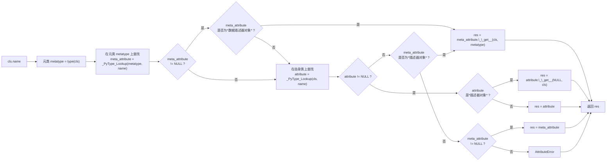

### 类成员的读取

读取类成员的步骤如下所示，即：

1. 先调用 _PyType_Lookup() 在元类上查找，若结果为数据描述器对象（即同时实现 @@tp_descr_get@@ 和 @@tp_descr_set@@），则调用其 `__get__(cls, type(cls))` 方法获取值并返回。

    * 查找的描述器对象属于元类成员，那么 @@__get__[2]@@ 参数中的 *obj* 应是当前类型，以及 *objtype* 是元类。

2. 否则继续调用 _PyType_Lookup() 在当前类上查找，若结果为描述器，则调用其 `__get__(NULL, cls)` 方法获取值返回。否则，若结果不为 *NULL*，则直接返回。

    * 查找的描述器对象属于当前类成员，那么 @@__get__[2]@@ 参数中的 *obj* 由于未知，则为 *NULL*，而 *objtype* 则为当前类。

    * 第一步先不在当前类上寻找，而是先到元类上寻找有没有同名的数据描述器对象。其原因是类对象无法直接覆盖其元类已定义的数据描述器对象，覆盖行为会被该对象的 @@__set__[1]@@ 方法拦截，因此无需考虑该成员名称被类对象占用的情况。

    * 第二步只要在当前类上寻找到任何非 *NULL* 值都返回，是因为当前对象属于类对象，其充当元类实例的同时也声明了其派生实例对象的属性和方法成员，除可通过其实例对象访问它们，也可以通过类本身访问。

3. 若在当前类找不到且之前元类查找结果是描述器对象，则调用 `__get__(cls, type(cls))` 方法获取值并返回。

    * 其参数传递与第一步相同，此时获取的结果是类对象继承自元类的方法成员。放在第三步而不是第一步后面是考虑到该描述器对象没有 @@__set__[1]@@ 方法，其可能会被类对象覆盖，那么则会由第二步返回覆盖值。

4. 若元类查找的结果是非 *NULL* 的值，则直接返回，否则抛出 AttributeError 异常。



```c
// Include/descrobject.h#PyDescr_IsData
#define PyDescr_IsData(d) (Py_TYPE(d)->tp_descr_set != NULL)

// Objects/typeobject.c#type_getattro
/* This is similar to PyObject_GenericGetAttr(),
   but uses _PyType_Lookup() instead of just looking in type->tp_dict. */
static PyObject *
type_getattro(PyTypeObject *type, PyObject *name)
{
    PyTypeObject *metatype = Py_TYPE(type);
    PyObject *meta_attribute, *attribute;
    descrgetfunc meta_get;
    PyObject* res;

    if (!PyUnicode_Check(name)) {
        PyErr_Format(PyExc_TypeError,
                     "attribute name must be string, not '%.200s'",
                     name->ob_type->tp_name);
        return NULL;
    }

    /* Initialize this type (we'll assume the metatype is initialized) */
    if (type->tp_dict == NULL) {
        if (PyType_Ready(type) < 0)
            return NULL;
    }

    /* No readable descriptor found yet */
    meta_get = NULL;

    /* Look for the attribute in the metatype */
    meta_attribute = _PyType_Lookup(metatype, name);

    // type.data_descr 会走这里
    if (meta_attribute != NULL) {
        Py_INCREF(meta_attribute);
        meta_get = Py_TYPE(meta_attribute)->tp_descr_get;

        if (meta_get != NULL && PyDescr_IsData(meta_attribute)) {
            /* Data descriptors implement tp_descr_set to intercept
             * writes. Assume the attribute is not overridden in
             * type's tp_dict (and bases): call the descriptor now.
             */
            res = meta_get(meta_attribute, (PyObject *)type,
                           (PyObject *)metatype);
            Py_DECREF(meta_attribute);
            return res;
        }
    }

    // type.method_descr 会走这里
    /* No data descriptor found on metatype. Look in tp_dict of this
     * type and its bases */
    attribute = _PyType_Lookup(type, name);
    if (attribute != NULL) {
        /* Implement descriptor functionality, if any */
        Py_INCREF(attribute);
        descrgetfunc local_get = Py_TYPE(attribute)->tp_descr_get;

        Py_XDECREF(meta_attribute);

        if (local_get != NULL) {
            /* NULL 2nd argument indicates the descriptor was
             * found on the target object itself (or a base)  */
            res = local_get(attribute, (PyObject *)NULL,
                            (PyObject *)type);
            Py_DECREF(attribute);
            return res;
        }

        return attribute;
    }

    /* No attribute found in local __dict__ (or bases): use the
     * descriptor from the metatype, if any */
    if (meta_get != NULL) {
        PyObject *res;
        res = meta_get(meta_attribute, (PyObject *)type,
                       (PyObject *)metatype);
        Py_DECREF(meta_attribute);
        return res;
    }

    /* If an ordinary attribute was found on the metatype, return it now */
    if (meta_attribute != NULL) {
        return meta_attribute;
    }

    /* Give up */
    PyErr_Format(PyExc_AttributeError,
                 "type object '%.50s' has no attribute '%U'",
                 type->tp_name, name);
    return NULL;
}
```

由 _PyType_Lookup() 实现在类型上查找成员，考虑到成员可能继承自父类型，由 find_name_in_mro() 依据类型的 MRO 序列顺序查找。一般来说，修改类型对象的频率较低，那么为加速成员的查找，可对查找的结果进行缓存优化。

```c
// Objects/typeobject.c#_PyType_Lookup
/* Internal API to look for a name through the MRO.
   This returns a borrowed reference, and doesn't set an exception! */
PyObject *
_PyType_Lookup(PyTypeObject *type, PyObject *name)
{
    PyObject *res;
    int error;
    unsigned int h;

    if (MCACHE_CACHEABLE_NAME(name) &&
        PyType_HasFeature(type, Py_TPFLAGS_VALID_VERSION_TAG)) {
        /* fast path */
        h = MCACHE_HASH_METHOD(type, name);
        if (method_cache[h].version == type->tp_version_tag &&
            method_cache[h].name == name) {
#if MCACHE_STATS
            method_cache_hits++;
#endif
            return method_cache[h].value;
        }
    }

    /* We may end up clearing live exceptions below, so make sure it's ours. */
    assert(!PyErr_Occurred());

    res = find_name_in_mro(type, name, &error);
    /* Only put NULL results into cache if there was no error. */
    if (error) {
        /* It's not ideal to clear the error condition,
           but this function is documented as not setting
           an exception, and I don't want to change that.
           E.g., when PyType_Ready() can't proceed, it won't
           set the "ready" flag, so future attempts to ready
           the same type will call it again -- hopefully
           in a context that propagates the exception out.
        */
        if (error == -1) {
            PyErr_Clear();
        }
        return NULL;
    }

    if (MCACHE_CACHEABLE_NAME(name) && assign_version_tag(type)) {
        h = MCACHE_HASH_METHOD(type, name);
        method_cache[h].version = type->tp_version_tag;
        method_cache[h].value = res;  /* borrowed */
        Py_INCREF(name);
        assert(((PyASCIIObject *)(name))->hash != -1);
#if MCACHE_STATS
        if (method_cache[h].name != Py_None && method_cache[h].name != name)
            method_cache_collisions++;
        else
            method_cache_misses++;
#endif
        Py_SETREF(method_cache[h].name, name);
    }
    return res;
}
```

* 先关注 find_name_in_mro() 的实现。由于 Python 支持多继承，为此在类型的初始化期间会先计算出线性查找成员的类型序列并存入 @@tp_mro@@ 槽，以便于成员查找时访问。同时，类型初始化期间还会统一将仅当前类型实现的成员放入类实例字典 @@tp_dict@@ 中，那么成员查找时只需逐个遍历 @@tp_mro@@ 中类型对象的类实例字典，若存在目标成员则直接返回，若最终也没找到则返回 *NULL*

```c
// Objects/typeobject.c#find_name_in_mro
/* Internal API to look for a name through the MRO, bypassing the method cache.
   This returns a borrowed reference, and might set an exception.
   'error' is set to: -1: error with exception; 1: error without exception; 0: ok */
static PyObject *
find_name_in_mro(PyTypeObject *type, PyObject *name, int *error)
{
    Py_ssize_t i, n;
    PyObject *mro, *res, *base, *dict;
    Py_hash_t hash;

    if (!PyUnicode_CheckExact(name) ||
        (hash = ((PyASCIIObject *) name)->hash) == -1)
    {
        hash = PyObject_Hash(name);
        if (hash == -1) {
            *error = -1;
            return NULL;
        }
    }

    /* Look in tp_dict of types in MRO */
    mro = type->tp_mro;

    if (mro == NULL) {
        if ((type->tp_flags & Py_TPFLAGS_READYING) == 0) {
            if (PyType_Ready(type) < 0) {
                *error = -1;
                return NULL;
            }
            mro = type->tp_mro;
        }
        if (mro == NULL) {
            *error = 1;
            return NULL;
        }
    }

    res = NULL;
    /* Keep a strong reference to mro because type->tp_mro can be replaced
       during dict lookup, e.g. when comparing to non-string keys. */
    Py_INCREF(mro);
    assert(PyTuple_Check(mro));
    n = PyTuple_GET_SIZE(mro);
    for (i = 0; i < n; i++) {
        base = PyTuple_GET_ITEM(mro, i);
        assert(PyType_Check(base));
        dict = ((PyTypeObject *)base)->tp_dict;
        assert(dict && PyDict_Check(dict));
        res = _PyDict_GetItem_KnownHash(dict, name, hash);
        if (res != NULL)
            break;
        if (PyErr_Occurred()) {
            *error = -1;
            goto done;
        }
    }
    *error = 0;
done:
    Py_DECREF(mro);
    return res;
}
```

* 查找到结果后，可对结果进行缓存，缓存的设计如下：

    * 全局缓存表 *method_cache* 允许最大 $2^\text{MCACHE\_SIZE\_EXP} = 2^{12} = 4096$ 个缓存项，依靠下标进行缓存索引。各缓存项具有三个字段，分别是版本号、成员名称和成员值，其中版本号用于判断缓存项是否过期。

    * 缓存之间需校验是否支持缓存，首先被缓存的成员名称必须是字符串对象，且字符串长度需小于等于 $\text{MCACHE\_MAX\_ATTR\_SIZE} = 100$。因为缓存表持有成员名称的强引用，而长字符串出现频率较低以及占用内存较大的特点不适合缓存。

    * 其次是需要 assign_version_tag() 为类对象分配版本号，为类对象而不是其它是因为类发生改变就可能导致其成员的改变，故只要类发生改变就需要分配新的版本号。

        * 若类型版本号有效，即 @@Py_TPFLAGS_VALID_VERSION_TAG@@ 标志位有效，则说明类对象未发生过修改，之前分配的版本号仍然有效，直接返回即可。

        * 若类型不支持缓存，如类型的 MRO 由非标准实现计算的，即 @@Py_TPFLAGS_HAVE_VERSION_TAG@@ 标志位无效，则返回 *0* 表明不允许缓存。

        * 版本号从全局的 `unsigned int` 类型计数器获取，在计数器为 *0* 时将整个缓存表初始化为空，并调用 @@CAPI_PyType_Modified[1]@@ 标记所有 object 的子类型缓存失效。计数器为 *0* 有两种情况，一种是刚初始化的时候，另一种是溢出的时候，溢出的时候也需要重置缓存表是因为版本号共用问题。

        * 分配版本号时先为所有父类分配后才为当前类型分配，版本号存储到类型的 @@tp_version_tag@@ 槽，分配成功后标记 @@Py_TPFLAGS_VALID_VERSION_TAG@@ 有效。必须先给父类分配是因为查找结果可能与父类相关，那么设计为父类缓存无效则子类缓存也无效，则只要当前类型 @@Py_TPFLAGS_HAVE_VERSION_TAG@@ 有效，即表明继承结构中的类都未发生过修改，无需对父类进行检查。

    * 若一切顺利，则表明允许缓存。缓存的索引由版本号和成员名称计算得到，即 $(\text{version} \oplus \text{name\_hash}) \pmod{2^\text{MCACHE\_SIZE\_EXP}}$，其中版本号与成员名称哈希值的异或加后模与最大数组长度以保证合法的下标值。得到下标索引后则将值写入相应缓存项即可，其不会检查对应项是否缓存有效，不做缓存冲突处理。

```c
// Objects/typeobject.c#MCACHE_MAX_ATTR_SIZE,...,next_version_tag
/* The cache can keep references to the names alive for longer than
   they normally would.  This is why the maximum size is limited to
   MCACHE_MAX_ATTR_SIZE, since it might be a problem if very large
   strings are used as attribute names. */
#define MCACHE_MAX_ATTR_SIZE    100
#define MCACHE_SIZE_EXP         12
#define MCACHE_HASH(version, name_hash)                                 \
        (((unsigned int)(version) ^ (unsigned int)(name_hash))          \
         & ((1 << MCACHE_SIZE_EXP) - 1))
#define MCACHE_HASH_METHOD(type, name)                                  \
        MCACHE_HASH((type)->tp_version_tag,                     \
                    ((PyASCIIObject *)(name))->hash)
#define MCACHE_CACHEABLE_NAME(name)                             \
        PyUnicode_CheckExact(name) &&                           \
        PyUnicode_IS_READY(name) &&                             \
        PyUnicode_GET_LENGTH(name) <= MCACHE_MAX_ATTR_SIZE

struct method_cache_entry {
    unsigned int version;
    PyObject *name;             /* reference to exactly a str or None */
    PyObject *value;            /* borrowed */
};

static struct method_cache_entry method_cache[1 << MCACHE_SIZE_EXP];
static unsigned int next_version_tag = 0;

// Objects/typeobject.c#find_name_in_mro
PyObject *
_PyType_Lookup(PyTypeObject *type, PyObject *name)
{
    ...

    if (MCACHE_CACHEABLE_NAME(name) && assign_version_tag(type)) {
        h = MCACHE_HASH_METHOD(type, name);
        method_cache[h].version = type->tp_version_tag;
        method_cache[h].value = res;  /* borrowed */
        Py_INCREF(name);
        assert(((PyASCIIObject *)(name))->hash != -1);
#if MCACHE_STATS
        if (method_cache[h].name != Py_None && method_cache[h].name != name)
            method_cache_collisions++;
        else
            method_cache_misses++;
#endif
        Py_SETREF(method_cache[h].name, name);
    }

    ...
}

// Objects/typeobject.c#find_name_in_mro
static int
assign_version_tag(PyTypeObject *type)
{
    /* Ensure that the tp_version_tag is valid and set
       Py_TPFLAGS_VALID_VERSION_TAG.  To respect the invariant, this
       must first be done on all super classes.  Return 0 if this
       cannot be done, 1 if Py_TPFLAGS_VALID_VERSION_TAG.
    */
    Py_ssize_t i, n;
    PyObject *bases;

    if (PyType_HasFeature(type, Py_TPFLAGS_VALID_VERSION_TAG))
        return 1;
    if (!PyType_HasFeature(type, Py_TPFLAGS_HAVE_VERSION_TAG))
        return 0;
    if (!PyType_HasFeature(type, Py_TPFLAGS_READY))
        return 0;

    type->tp_version_tag = next_version_tag++;
    /* for stress-testing: next_version_tag &= 0xFF; */

    if (type->tp_version_tag == 0) {
        /* wrap-around or just starting Python - clear the whole
           cache by filling names with references to Py_None.
           Values are also set to NULL for added protection, as they
           are borrowed reference */
        for (i = 0; i < (1 << MCACHE_SIZE_EXP); i++) {
            method_cache[i].value = NULL;
            Py_INCREF(Py_None);
            Py_XSETREF(method_cache[i].name, Py_None);
        }
        /* mark all version tags as invalid */
        PyType_Modified(&PyBaseObject_Type);
        return 1;
    }
    bases = type->tp_bases;
    n = PyTuple_GET_SIZE(bases);
    for (i = 0; i < n; i++) {
        PyObject *b = PyTuple_GET_ITEM(bases, i);
        assert(PyType_Check(b));
        if (!assign_version_tag((PyTypeObject *)b))
            return 0;
    }
    type->tp_flags |= Py_TPFLAGS_VALID_VERSION_TAG;
    return 1;
}
```

* 在下一次的成员获取中，若访问的成员名称是有可能缓存的以及类型的版本号有效，则从缓存表中检查目标成员是否有缓存，有则直接返回，否则进入正常的成员查找逻辑。

```c
// Objects/typeobject.c#find_name_in_mro
PyObject *
_PyType_Lookup(PyTypeObject *type, PyObject *name)
{
    ...

    if (MCACHE_CACHEABLE_NAME(name) &&
        PyType_HasFeature(type, Py_TPFLAGS_VALID_VERSION_TAG)) {
        /* fast path */
        h = MCACHE_HASH_METHOD(type, name);
        if (method_cache[h].version == type->tp_version_tag &&
            method_cache[h].name == name) {
#if MCACHE_STATS
            method_cache_hits++;
#endif
            return method_cache[h].value;
        }
    }

    ...
}
```

总结来说，类对象是一种特殊的类，读取的类成员可能是元类描述当前类的成员，也可能是当前类描述其实例的成员。尽管 Python 对象易变，但也可能并非真实易变，细粒度的优化是必要的。
