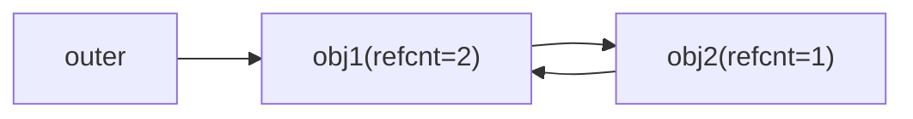
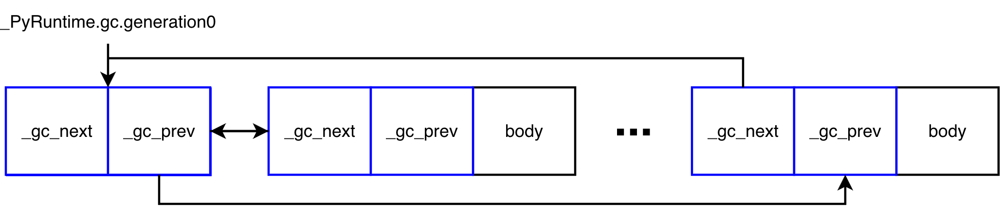
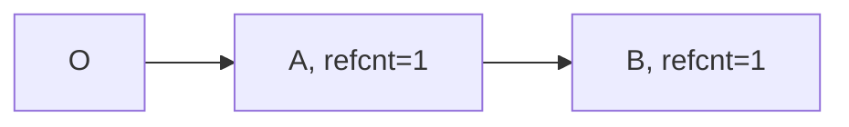
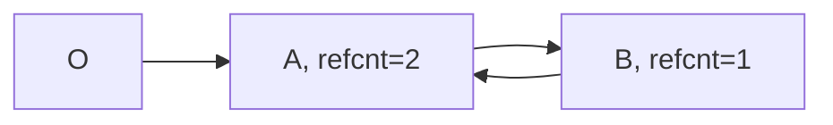
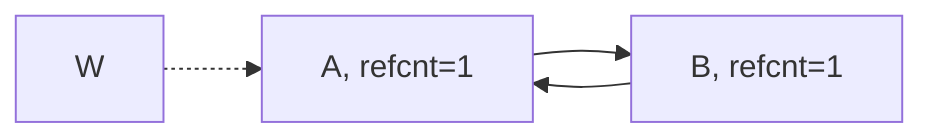

### 销毁存在循环引用的对象

考虑如下图示的三个对象，*outer*、*obj1* 和 *obj2*，其中 *obj1* 和 *obj2* 互相持有对方的强引用，当 *outer* 释放对 *obj1* 的引用后，*obj1* 和 *obj2* 便形成孤立引用循环，外界无法访问到它们，故不会触发 @@CAPI_Py_DECREF@@ 将引用计数减为 *0* 来销毁它们。这样的情况常发生在可持有其他对象强引用的容器对象中，可引入 GC 机制来识别这样的引用循环，然后打破循环从而实现对它们的回收。



一般来说，能够持有其他对象强引用的对象都应支持 GC 的相应接口，即为类型实现如 @@Py_TPFLAGS_HAVE_GC@@、@@tp_traverse@@ 和 @@tp_clear@@ 等槽。对于如 `class` 创建堆类型，默认是 GC 类型。除支持相应的 GC 能力外，还应在对象创建完成后通过 @@CAPI_PyObject_GC_Track@@ 将对象加入到 GC 的追踪链表，以允许 GC 对它们进行扫描。GC 链表由对象头部的 PyGC_Head 实现，其在对象创建时分配。Python 将对象分成不同的代，新创建的对象默认加入到第 *0* 代链表中，即 `_PyRuntime.gc.generation0`，其是一个带头节点的双向链表，最后一个节点即由头节点的 *_gc_prev* 指向。

```c
// Include/internal/pycore_object.h#_PyObject_GC_TRACK
#define _PyObject_GC_TRACK(op) \
    _PyObject_GC_TRACK_impl(__FILE__, __LINE__, _PyObject_CAST(op))

// Include/internal/pycore_object.h#_PyObject_GC_TRACK_impl
static inline void _PyObject_GC_TRACK_impl(const char *filename, int lineno,
                                           PyObject *op)
{
    _PyObject_ASSERT_FROM(op, !_PyObject_GC_IS_TRACKED(op),
                          "object already tracked by the garbage collector",
                          filename, lineno, "_PyObject_GC_TRACK");

    PyGC_Head *gc = _Py_AS_GC(op);
    _PyObject_ASSERT_FROM(op,
                          (gc->_gc_prev & _PyGC_PREV_MASK_COLLECTING) == 0,
                          "object is in generation which is garbage collected",
                          filename, lineno, "_PyObject_GC_TRACK");

    PyGC_Head *last = (PyGC_Head*)(_PyRuntime.gc.generation0->_gc_prev);
    _PyGCHead_SET_NEXT(last, gc);  // last->_gc_next = gc
    _PyGCHead_SET_PREV(gc, last);  // gc->_gc_prev = last
    _PyGCHead_SET_NEXT(gc, _PyRuntime.gc.generation0);
    _PyRuntime.gc.generation0->_gc_prev = (uintptr_t)gc;
}

// Include/cpython/objimpl.h#_Py_AS_GC
#define _Py_AS_GC(o) ((PyGC_Head *)(o)-1)

// Include/cpython/objimpl.h#PyGC_Head
/* GC information is stored BEFORE the object structure. */
typedef struct {
    // Pointer to next object in the list.
    // 0 means the object is not tracked
    uintptr_t _gc_next;

    // Pointer to previous object in the list.
    // Lowest two bits are used for flags documented later.
    uintptr_t _gc_prev;
} PyGC_Head;
```


<p align="center"><em>第 0 代 GC 链表结构示意图，蓝框表示 PyGC_Head，黑框的 body 表示对象本体。</em></p>

对象被 GC 最终后还需要相应机制来触发 GC 的扫描，常见的触发方式有为对象分配内存后检查相应条件从而决定是否触发或是手动通过如 @@PyAPI_gc_collect@@ 接口触发。基于条件的触发方式核心判断第 *0* 代的净分配数 *count* 是否超过门限值 *threshold* 来触发，考虑净分配数而不是总分配数是为了避免频繁触发 GC 扫描，GC 的主要目标是释放闲置的内存，只要实际分配空间控制在门限范围内，那么无论中间动态分配释放多少次内存都与 GC 的目标无关，即只有当内存*不够*时，才会尝试释放垃圾对象所占用内存。

```c
// Modules/gcmodule.c#_PyObject_GC_Alloc
static PyObject *
_PyObject_GC_Alloc(int use_calloc, size_t basicsize)
{
    ...

    state->generations[0].count++; /* number of allocated GC objects */
    if (state->generations[0].count > state->generations[0].threshold &&
        // 对象净分配数（总分配数 - 总释放数）达到阈值，触发垃圾回收
        state->enabled &&      // 开启 GC 回收
        state->generations[0].threshold &&  // 门限值有效
        !state->collecting &&  // 当前没有正在进行的回收
        !PyErr_Occurred()) {
        state->collecting = 1;
        collect_generations(state);
        state->collecting = 0;
    }
    op = FROM_GC(g);
    return op;
}
```

O 存活在 S 外，B 的引用减为 0，后续重新恢复





