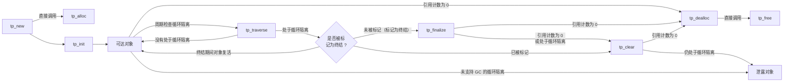

## 对象生命周期

参照 @@lifecycle-events@@，Python 对象的生命周期事件关系可概括如下图所示。考虑一般情况，设堆类型 A 的元类为 type，父类是 object。



### 创建对象

当通过 `A()` 方式构造一个新对象时，相当于调用 A 对象类型的 @@tp_call@@ 实现，而对于 A 对象即调用 `type_call(A, *args, **kwds)` 创建对象。具体来说，其先调用 `A->tp_new(A, *args, **kwds)` 创建出对象，记做 *obj*，然后可选调用 `A.__init__(obj, *args, **kwds)` 初始化对象。考虑 A 尚未覆盖任何默认实现，其中 `A->tp_new` 继承自 object 的 @@tp_new@@ 槽，即 object_new()，以及实例内存分配调用的 `A->tp_alloc` 则继承自 object 的 @@tp_alloc@@ 槽，即 @@CAPI_PyType_GenericAlloc@@。

```c
// Objects/typeobject.c#type_call
static PyObject *
type_call(PyTypeObject *type, PyObject *args, PyObject *kwds)
{
    PyObject *obj;

    if (type->tp_new == NULL) {
        PyErr_Format(PyExc_TypeError,
                     "cannot create '%.100s' instances",
                     type->tp_name);
        return NULL;
    }

    ...

    obj = type->tp_new(type, args, kwds);
    obj = _Py_CheckFunctionResult((PyObject*)type, obj, NULL);
    if (obj == NULL)
        return NULL;

    ...

    type = Py_TYPE(obj);
    if (type->tp_init != NULL) {
        int res = type->tp_init(obj, args, kwds);
        if (res < 0) {
            assert(PyErr_Occurred());
            Py_DECREF(obj);
            obj = NULL;
        }
        else {
            assert(!PyErr_Occurred());
        }
    }
    return obj;
}

// Objects/typeobject.c#object_new
static PyObject *
object_new(PyTypeObject *type, PyObject *args, PyObject *kwds)
{
    if (excess_args(args, kwds)) {
        // tp_new 继承自 object_new，但实现了 tp_init
        if (type->tp_new != object_new) {
            PyErr_SetString(PyExc_TypeError,
                            "object.__new__() takes exactly one argument (the type to instantiate)");
            return NULL;
        }
        if (type->tp_init == object_init) {
            PyErr_Format(PyExc_TypeError, "%.200s() takes no arguments",
                         type->tp_name);
            return NULL;
        }
    }

    if (type->tp_flags & Py_TPFLAGS_IS_ABSTRACT) {
        /* 调用抽象类型的异常处理 */
        return NULL;
    }
    return type->tp_alloc(type, 0);
}
```

为对象分配内存分为两种情况，即 GC 类型和非 GC 类型。前者表明对象需 GC 对其追踪和管理，因此需额外增加维护 GC 的开销，即 GC 类型的对象需在 PyObject 前隐式增加一个 GC 头用作 GC 对象管理，反之后者则表明对象无需 GC 管理。

* 分配内存前，先依据类型中记录的基本对象大小 @@tp_basicsize@@ 和变长项大小 @@tp_itemsize@@ 计算分配对象所需内存，实际分配大小为计算大小向上对齐到 `sizeof(void*)` 的最小整数倍大小，目的是便于内存的管理。如此设计带来一个特性，即在至少 32 位及以上计算机的最小分配内存大小为 4B，则低 2 位地址永远是 0。

* 分配内存后，会进行轻量化的 GC 触发检查，以保证后续内存分配时具有足够的空间。

PyObject 作为所有 Python 对象的前缀，在内存分配后需负责对其进行初始化。具体来说，将类型字段 *ob_type* 设置为实际实例化对象的类型对象，初始强引用计数 *refcnt* 初始化为 *1*，将引用移交给实际创建对象的函数。若对象是变长的，即前缀是 PyVarObject，则由额外的 *ob_size* 记录变长成员的数量。

```c
// Objects/typeobject.c#PyType_GenericAlloc
PyObject *
PyType_GenericAlloc(PyTypeObject *type, Py_ssize_t nitems)
{
    PyObject *obj;
    const size_t size = _PyObject_VAR_SIZE(type, nitems+1);
    /* note that we need to add one, for the sentinel */

    if (PyType_IS_GC(type))
        obj = _PyObject_GC_Malloc(size);
    else
        obj = (PyObject *)PyObject_MALLOC(size);

    if (obj == NULL)
        return PyErr_NoMemory();

    memset(obj, '\0', size);

    if (type->tp_itemsize == 0)
        (void)PyObject_INIT(obj, type);
    else
        (void) PyObject_INIT_VAR((PyVarObject *)obj, type, nitems);

    if (PyType_IS_GC(type))
        _PyObject_GC_TRACK(obj);
    return obj;
}

// Include/objimpl.h#_PyObject_VAR_SIZE
#define _PyObject_VAR_SIZE(typeobj, nitems)     \
    _Py_SIZE_ROUND_UP((typeobj)->tp_basicsize + \
        (nitems)*(typeobj)->tp_itemsize,        \
        SIZEOF_VOID_P)

// Modules/gcmodule.c#_PyObject_GC_Malloc
PyObject *
_PyObject_GC_Malloc(size_t basicsize)
{
    return _PyObject_GC_Alloc(0, basicsize);
}

// Modules/gcmodule.c#_PyObject_GC_Alloc
static PyObject *
_PyObject_GC_Alloc(int use_calloc, size_t basicsize)
{
    struct _gc_runtime_state *state = &_PyRuntime.gc;
    PyObject *op;
    PyGC_Head *g;
    size_t size;
    if (basicsize > PY_SSIZE_T_MAX - sizeof(PyGC_Head))
        return PyErr_NoMemory();
    size = sizeof(PyGC_Head) + basicsize;
    if (use_calloc)
        g = (PyGC_Head *)PyObject_Calloc(1, size);
    else
        g = (PyGC_Head *)PyObject_Malloc(size);
    if (g == NULL)
        return PyErr_NoMemory();
    assert(((uintptr_t)g & 3) == 0);  // g must be aligned 4bytes boundary
    g->_gc_next = 0;
    g->_gc_prev = 0;
    state->generations[0].count++; /* number of allocated GC objects */
    if (state->generations[0].count > state->generations[0].threshold &&
        // 对象净分配数（总分配数 - 总释放数）达到阈值，触发垃圾回收
        state->enabled &&      // 开启 GC 回收
        state->generations[0].threshold &&  // 门限值有效
        !state->collecting &&  // 当前没有正在进行的回收
        !PyErr_Occurred()) {
        state->collecting = 1;
        collect_generations(state);
        state->collecting = 0;
    }
    op = FROM_GC(g);
    return op;
}

// Include/objimpl.h#PyObject_INIT
#define PyObject_INIT(op, typeobj) \
    _PyObject_INIT(_PyObject_CAST(op), (typeobj))

// Include/objimpl.h#_PyObject_INIT_VAR
static inline PyVarObject*
_PyObject_INIT_VAR(PyVarObject *op, PyTypeObject *typeobj, Py_ssize_t size)
{
    assert(op != NULL);
    Py_SIZE(op) = size;  // op->ob_size = size
    PyObject_INIT((PyObject *)op, typeobj);
    return op;
}

// Include/objimpl.h#_PyObject_INIT
static inline PyObject*
_PyObject_INIT(PyObject *op, PyTypeObject *typeobj)
{
    assert(op != NULL);
    Py_TYPE(op) = typeobj;  // op->ob_type = typeobj
    if (PyType_GetFlags(typeobj) & Py_TPFLAGS_HEAPTYPE) {
        // 静态类型不进入 Python 内存管理范畴
        Py_INCREF(typeobj);
    }
    _Py_NewReference(op);  // op->ob_refcnt = 1
    return op;
}
```

### 销毁对象

对象在存活期间，若在某时刻其引用计数由 @@CAPI_Py_DECREF@@ 变为了 *0*，则立即触发对象的销毁，即调用其类型的 @@tp_dealloc@@ 实现销毁对象。

```c
// Include/object.h#Py_DECREF
#define Py_DECREF(op) _Py_DECREF(__FILE__, __LINE__, _PyObject_CAST(op))

// Include/object.h#_Py_DECREF
static inline void _Py_DECREF(const char *filename, int lineno,
                              PyObject *op)
{
    (void)filename; /* may be unused, shut up -Wunused-parameter */
    (void)lineno; /* may be unused, shut up -Wunused-parameter */
    _Py_DEC_REFTOTAL;
    if (--op->ob_refcnt != 0) {
#ifdef Py_REF_DEBUG
        if (op->ob_refcnt < 0) {
            _Py_NegativeRefcount(filename, lineno, op);
        }
#endif
    }
    else {
        _Py_Dealloc(op);
    }
}

// Objects/object.c#_Py_Dealloc
void
_Py_Dealloc(PyObject *op)
{
    destructor dealloc = Py_TYPE(op)->tp_dealloc;
#ifdef Py_TRACE_REFS
    _Py_ForgetReference(op);
#else
    _Py_INC_TPFREES(op);
#endif
    (*dealloc)(op);
}
```

若 `obj = A()` 由于引用计数为 *0* 进入销毁，若 A 由 `class` 创建，则 A 默认是 GC 类型，其 @@tp_dealloc@@ 实现默认为 subtype_dealloc()。A 还可能是非 GC 类型，即如 A 由静态实现，此时则由自主实现的 @@tp_dealloc@@ 销毁对象，或由 @@CAPI_PyType_FromSpec@@ 接口创建的非 GC 类型，其 @@tp_dealloc@@ 的实现与 `class` 一致。

* 非 GC 类型的对象通常不是容器对象，如 object 类型，其实例 PyObject 不能持有其它对象的引用，故不会导致循环引用问题，因此无需支持 GC。考虑由 @@CAPI_PyType_FromSpec@@ 接口创建的非 GC 堆类型，其销毁仅需调用相应事件函数即可。

    * 首先检查对象是否实现 @@tp_finalize@@ 槽，若有实现则由 @@CAPI_PyObject_CallFinalizerFromDealloc@@ 接口尝试调用。若该接口返回 *-1* 表明在执行 @@__del__@@ 代码期间发生对象复活，此时不再执行后续的对象销毁流程。@@tp_del@@ 已被 @@tp_finalize@@ 替代，为兼容目的也会检查并调用。类似地，若对象执行清理后复活则直接退出。
    
    * 面向对象中允许通过继承扩展类型，Python 中各扩展层需要负责清理其所扩展的资源。因此，在对象正常清理完该层的扩展后，还需在父类链中从下往上寻找 @@tp_dealloc@@ 不同于当前类型的第一个父类 *base*，然后调用它销毁对象的其余部分。对于一般情况下的 *obj* 对象而言，其父类是 object，那么这里会调用 object_dealloc()，即调用与 @@tp_alloc@@ 相对的 @@tp_free@@ 释放对象的内存。

    * 若被销毁对象是堆类型，还需将其类型的引用计数减 *1*，因为对象的 *ob_type* 释放了对其类型的引用。为避免多次减操作，需检查 *base* 是否为堆类型，若是则其也会尝试减，那么实际的减应由直接继承 object 的堆类型完成。
    
```c
// Objects/typeobject.c#subtype_dealloc
static void
subtype_dealloc(PyObject *self)
{
    PyTypeObject *type, *base;
    destructor basedealloc;
    int has_finalizer;

    /* Extract the type; we expect it to be a heap type */
    type = Py_TYPE(self);
    // 不允许销毁静态分配类型
    _PyObject_ASSERT((PyObject *)type, type->tp_flags & Py_TPFLAGS_HEAPTYPE);

    /* Test whether the type has GC exactly once */

    if (!PyType_IS_GC(type)) {  // 非 GC 类型对象销毁
        /* A non GC dynamic type allows certain simplifications:
           there's no need to call clear_slots(), or DECREF the dict,
           or clear weakrefs. */

        /* Maybe call finalizer; exit early if resurrected */
        if (type->tp_finalize) {  // 尝试调用 __del__ 方法执行对象清理
            if (PyObject_CallFinalizerFromDealloc(self) < 0)
                return;
        }
        if (type->tp_del) {  // 旧式的 __del__ 方法
            type->tp_del(self);
            if (self->ob_refcnt > 0)
                return;
        }

        /* Find the nearest base with a different tp_dealloc */
        base = type;
        while ((basedealloc = base->tp_dealloc) == subtype_dealloc) {
            base = base->tp_base;
            assert(base);
        }

        /* Extract the type again; tp_del may have changed it */
        type = Py_TYPE(self);

        /* Call the base tp_dealloc() */
        assert(basedealloc);
        basedealloc(self);

       /* Only decref if the base type is not already a heap allocated type.
          Otherwise, basedealloc should have decref'd it already */
        if (type->tp_flags & Py_TPFLAGS_HEAPTYPE && !(base->tp_flags & Py_TPFLAGS_HEAPTYPE))
            Py_DECREF(type);

        /* Done */
        return;
    }

    /* We get here only if the type has GC */
    ...
}

// Objects/typeobject.c#object_dealloc
static void
object_dealloc(PyObject *self)
{
    Py_TYPE(self)->tp_free(self);
}
```

* 上述中对 @@tp_finalize@@ 的调用不同于调用其它槽那么直接，主要因为 @@__del__@@ 内被设计允许执行任意的用户代码，

    * 一方面是对象可能在清理期间复活，如若将待销毁对象加入到某容器中，待销毁对象的引用计数便不再为 *0*，即对象复活了，此时要终止对其的销毁操作。然后是 @@tp_finalize@@ 被设计为只能执行一次，即若 _PyGC_FINALIZED() 表明对象已被标记为终结，则不会再重复执行 @@tp_finalize@@，即一个对象只有一次机会执行 @@__del__@@。因为重复执行它可能导致不可预测的行为，如重新释放已经释放的资源或对象无限复活等。
    
    * 另外，在调用 @@tp_finalize@@ 前会先将当前对象的引用计数加 *1*，即避免销毁循环引用对象时再次触发对当前对象的销毁。执行结束后删除引用也不能由 @@CAPI_Py_DECREF@@ 进行，这也可能会触发对象的重复销毁。若对象没有复活，则返回 *0*，否则返回 *-1*。

```c
// Objects/typeobject.c#PyObject_CallFinalizerFromDealloc
int
PyObject_CallFinalizerFromDealloc(PyObject *self)
{
    Py_ssize_t refcnt;

    /* Temporarily resurrect the object. */
    if (self->ob_refcnt != 0) {
        Py_FatalError("PyObject_CallFinalizerFromDealloc called on "
                      "object with a non-zero refcount");
    }
    self->ob_refcnt = 1;

    PyObject_CallFinalizer(self);

    /* Undo the temporary resurrection; can't use DECREF here, it would
     * cause a recursive call.
     */
    _PyObject_ASSERT_WITH_MSG(self,
                              self->ob_refcnt > 0,
                              "refcount is too small");
    if (--self->ob_refcnt == 0)
        return 0;         /* this is the normal path out */

    /* tp_finalize resurrected it!  Make it look like the original Py_DECREF
     * never happened.
     */
    refcnt = self->ob_refcnt;
    _Py_NewReference(self);
    self->ob_refcnt = refcnt;

    _PyObject_ASSERT(self,
                     (!PyType_IS_GC(Py_TYPE(self))
                      || _PyObject_GC_IS_TRACKED(self)));
    /* If Py_REF_DEBUG, _Py_NewReference bumped _Py_RefTotal, so
     * we need to undo that. */
    _Py_DEC_REFTOTAL;
    /* If Py_TRACE_REFS, _Py_NewReference re-added self to the object
     * chain, so no more to do there.
     * If COUNT_ALLOCS, the original decref bumped tp_frees, and
     * _Py_NewReference bumped tp_allocs:  both of those need to be
     * undone.
     */
#ifdef COUNT_ALLOCS
    --Py_TYPE(self)->tp_frees;
    --Py_TYPE(self)->tp_allocs;
#endif
    return -1;
}

// Objects/typeobject.c#PyObject_CallFinalizer
void
PyObject_CallFinalizer(PyObject *self)
{
    PyTypeObject *tp = Py_TYPE(self);

    if (tp->tp_finalize == NULL)
        return;
    /* tp_finalize should only be called once. */
    if (PyType_IS_GC(tp) && _PyGC_FINALIZED(self))
        return;

    tp->tp_finalize(self);
    if (PyType_IS_GC(tp)) {
        _PyGC_SET_FINALIZED(self);
    }
}
```

* GC 类型的销毁相比更复杂，首先执行销毁的代码需要被 Py_TRASHCAN_BEGIN() 和 Py_TRASHCAN_END() 宏包裹在中间，其目的是解决一个对象销毁时可能引起的一连串对象销毁，从而导致栈溢出问题。在对象清理期间若导致了大量相关对象销毁，则会先暂时将它们置于 *trash_delete_later* 链表，在其他销毁函数退出时由 Py_TRASHCAN_END() 从链表中取出对象进行销毁。注意到，

    * 进入 Py_TRASHCAN_BEGIN() 需满足一定条件，如进一步调用 *base* 的 @@tp_dealloc@@ 进行上一层销毁时不会再加入链表，因为对于半销毁对象而言，挂起时需要记录此时的 C 函数上下文，若能保证同一对象在销毁开始后就必须执行到结束则不会有这个问题。
    
    * 另外，_PyTrash_thread_destroy_chain() 在取出对象销毁前需要先将 trash_delete_nesting 加 *1*，销毁结束后再减 *1*。其目的是保证 @@tp_dealloc@@ 的正常退出，因为触发 Py_TRASHCAN_END() 进入 _PyTrash_thread_destroy_chain() 的条件是所有挂起垃圾对象的 @@tp_dealloc@@ 都已从 Py_TRASHCAN_END() 退出以及 *trash_delete_later* 链表不为空。此时，_PyTrash_thread_destroy_chain() 会循环从链表中取出对象并销毁，但每个对象销毁方法最后的 Py_TRASHCAN_END() 都会触发另一个 _PyTrash_thread_destroy_chain() 函数的调用，故每一个销毁方法都在等待下一个销毁方法的退出，形成隐式的递归，可能导致栈溢出。而若在其执行前使 trash_delete_nesting 加 *1* 可保证每个销毁方法都能正常退出后，然后由 _PyTrash_thread_destroy_chain() 中的 while 循环重新执行下一个。

```c
// Objects/typeobject.c#subtype_dealloc
static void
subtype_dealloc(PyObject *self)
{
    ...
    /* We get here only if the type has GC */

    /* UnTrack and re-Track around the trashcan macro, alas */
    /* See explanation at end of function for full disclosure */
    PyObject_GC_UnTrack(self);  // 从 GC 链表中移除对象
    Py_TRASHCAN_BEGIN(self, subtype_dealloc);

    ...

  endlabel:
    Py_TRASHCAN_END
}

// Include/object.h#Py_TRASHCAN_BEGIN
#define Py_TRASHCAN_BEGIN(op, dealloc) Py_TRASHCAN_BEGIN_CONDITION(op, \
        Py_TYPE(op)->tp_dealloc == (destructor)(dealloc))

// Include/object.h#Py_TRASHCAN_BEGIN_CONDITION
#define Py_TRASHCAN_BEGIN_CONDITION(op, cond) \
    do { \
        PyThreadState *_tstate = NULL; \
        /* If "cond" is false, then _tstate remains NULL and the deallocator \
         * is run normally without involving the trashcan */ \
        if (cond) { \
            _tstate = PyThreadState_GET(); \
            if (_tstate->trash_delete_nesting >= PyTrash_UNWIND_LEVEL) { \
                /* Store the object (to be deallocated later) and jump past \
                 * Py_TRASHCAN_END, skipping the body of the deallocator */ \
                _PyTrash_thread_deposit_object(_PyObject_CAST(op)); \
                /* 与 Py_TRASHCAN_END 的 while 循环配对，可实现跳出中间代码 */ \
                break; \  
            } \
            ++_tstate->trash_delete_nesting; \
        }

        /* The body of the deallocator is here. */

// Include/object.h#Py_TRASHCAN_END
#define Py_TRASHCAN_END \
        if (_tstate) { \
            --_tstate->trash_delete_nesting; \
            if (_tstate->trash_delete_later && _tstate->trash_delete_nesting <= 0) \
                _PyTrash_thread_destroy_chain(); \
        } \
    } while (0);

// Objects/object.c#_PyTrash_thread_deposit_object
/* The equivalent API, using per-thread state recursion info */
void
_PyTrash_thread_deposit_object(PyObject *op)
{
    PyThreadState *tstate = _PyThreadState_GET();
    _PyObject_ASSERT(op, PyObject_IS_GC(op));
    _PyObject_ASSERT(op, !_PyObject_GC_IS_TRACKED(op));
    _PyObject_ASSERT(op, op->ob_refcnt == 0);
    _PyGCHead_SET_PREV(_Py_AS_GC(op), tstate->trash_delete_later);
    tstate->trash_delete_later = op;
}

// Objects/object.c#_PyTrash_thread_destroy_chain
/* The equivalent API, using per-thread state recursion info */
void
_PyTrash_thread_destroy_chain(void)
{
    PyThreadState *tstate = _PyThreadState_GET();
    /* We need to increase trash_delete_nesting here, otherwise,
       _PyTrash_thread_destroy_chain will be called recursively
       and then possibly crash.  An example that may crash without
       increase:
           N = 500000  # need to be large enough
           ob = object()
           tups = [(ob,) for i in range(N)]
           for i in range(49):
               tups = [(tup,) for tup in tups]
           del tups
    */
    assert(tstate->trash_delete_nesting == 0);
    ++tstate->trash_delete_nesting;
    while (tstate->trash_delete_later) {
        PyObject *op = tstate->trash_delete_later;
        destructor dealloc = Py_TYPE(op)->tp_dealloc;

        tstate->trash_delete_later =
            (PyObject*) _PyGCHead_PREV(_Py_AS_GC(op));

        /* Call the deallocator directly.  This used to try to
         * fool Py_DECREF into calling it indirectly, but
         * Py_DECREF was already called on this object, and in
         * assorted non-release builds calling Py_DECREF again ends
         * up distorting allocation statistics.
         */
        _PyObject_ASSERT(op, op->ob_refcnt == 0);
        (*dealloc)(op);
        assert(tstate->trash_delete_nesting == 1);
    }
    --tstate->trash_delete_nesting;
}
```

* 对于 GC 堆类型对象销毁，总体上与非 GC 的类似，即先调用 @@__del__@@ 清理，然后再调用上一层析构方法销毁，不同之处在于需在其中穿插清理所持有的其他对象引用。另外，由于堆类型具有相同的结构，执行清理时仅处理当前层扩展的，否则可能导致重复清理。

```c
// Objects/typeobject.c#subtype_dealloc
static void
subtype_dealloc(PyObject *self)
{
    ...
    /* We get here only if the type has GC */

    /* UnTrack and re-Track around the trashcan macro, alas */
    /* See explanation at end of function for full disclosure */
    PyObject_GC_UnTrack(self);  // 从 GC 链表中移除对象
    Py_TRASHCAN_BEGIN(self, subtype_dealloc);

    /* Find the nearest base with a different tp_dealloc */
    /* subtype_dealloc 只负责清理 type ... < base 之间额外增加的资源 */
    base = type;
    while ((/*basedealloc =*/ base->tp_dealloc) == subtype_dealloc) {
        base = base->tp_base;
        assert(base);
    }

    has_finalizer = type->tp_finalize || type->tp_del;

    if (type->tp_finalize) {
        _PyObject_GC_TRACK(self);
        if (PyObject_CallFinalizerFromDealloc(self) < 0) {
            /* Resurrected */
            goto endlabel;
        }
        _PyObject_GC_UNTRACK(self);
    }
    /*
      If we added a weaklist, we clear it. Do this *before* calling tp_del,
      clearing slots, or clearing the instance dict.

      GC tracking must be off at this point. weakref callbacks (if any, and
      whether directly here or indirectly in something we call) may trigger GC,
      and if self is tracked at that point, it will look like trash to GC and GC
      will try to delete self again.
    */
    if (type->tp_weaklistoffset && !base->tp_weaklistoffset)
        PyObject_ClearWeakRefs(self);

    if (type->tp_del) {
        _PyObject_GC_TRACK(self);
        type->tp_del(self);
        if (self->ob_refcnt > 0) {
            /* Resurrected */
            goto endlabel;
        }
        _PyObject_GC_UNTRACK(self);
    }
    if (has_finalizer) {
        /* New weakrefs could be created during the finalizer call.
           If this occurs, clear them out without calling their
           finalizers since they might rely on part of the object
           being finalized that has already been destroyed. */
        if (type->tp_weaklistoffset && !base->tp_weaklistoffset) {
            /* Modeled after GET_WEAKREFS_LISTPTR() */
            PyWeakReference **list = (PyWeakReference **) \
                PyObject_GET_WEAKREFS_LISTPTR(self);
            while (*list)
                _PyWeakref_ClearRef(*list);  // 不再调用 callback
        }
    }

    /*  Clear slots up to the nearest base with a different tp_dealloc */
    base = type;
    while ((basedealloc = base->tp_dealloc) == subtype_dealloc) {
        // 每个基类都能定义 __slots__
        if (Py_SIZE(base))
            clear_slots(base, self);
        base = base->tp_base;
        assert(base);
    }

    /* If we added a dict, DECREF it */
    if (type->tp_dictoffset && !base->tp_dictoffset) {
        PyObject **dictptr = _PyObject_GetDictPtr(self);
        if (dictptr != NULL) {
            PyObject *dict = *dictptr;
            if (dict != NULL) {
                Py_DECREF(dict);
                *dictptr = NULL;
            }
        }
    }

    /* Extract the type again; tp_del may have changed it */
    type = Py_TYPE(self);

    /* Call the base tp_dealloc(); first retrack self if
     * basedealloc knows about gc.
     */
    if (PyType_IS_GC(base))
        _PyObject_GC_TRACK(self);
    assert(basedealloc);
    basedealloc(self);

    /* Can't reference self beyond this point. It's possible tp_del switched
       our type from a HEAPTYPE to a non-HEAPTYPE, so be careful about
       reference counting. Only decref if the base type is not already a heap
       allocated type. Otherwise, basedealloc should have decref'd it already */
    if (type->tp_flags & Py_TPFLAGS_HEAPTYPE && !(base->tp_flags & Py_TPFLAGS_HEAPTYPE))
        Py_DECREF(type);

  endlabel:
    Py_TRASHCAN_END
}
```

* 在进入 @@tp_finalize@@ 或 @@tp_del@@ 的执行前需重新将对象交由 GC 管理，因为 @@__del__@@ 被设计为可执行任意代码，那么就必须向用户暴露一个正常的对象。

    * 对于弱引用的清理，置于 @@tp_finalize@@ 和 @@tp_del@@ 的中间，因为前者的状态是得到保证的，即允许对象复活，而后者并没有保证，故需要为前者保留弱引用，此外也不能在 @@tp_del@@ 后处理弱引用，因为回调可能访问半销对象。但在 @@tp_del@@ 之后仍需再做一次清理，其可能引入新的弱引用。类似地，此时无法执行弱引用的回调，以避免回调访问处于空指针状态的引用。
    
    * 清理弱引用即将对象 @@tp_weaklistoffset@@ 偏移指向的弱引用列表清空，先清理弱引用对象的成员，如将弱引用的 *wr_object* 设置为 *None* 表明弱引用对象已被删除。然后检查回调并调用，若弱引用对象处于待回收状态，回调则不会被调用。若存在多个具有回调的弱引用时需先将弱引用对象全部摘出后再调用，如此以避免回调不能被正常调用。此外，执行回调期间若出现异常，不会抛出，只会打印异常警告消息，因此不会影响后续回调的执行。

```c
// Objects/typeobject.c#subtype_dealloc
static void
subtype_dealloc(PyObject *self)
{
    ...

    has_finalizer = type->tp_finalize || type->tp_del;

    if (type->tp_finalize) {
        _PyObject_GC_TRACK(self);
        if (PyObject_CallFinalizerFromDealloc(self) < 0) {
            /* Resurrected */
            goto endlabel;
        }
        _PyObject_GC_UNTRACK(self);
    }
    /*
      If we added a weaklist, we clear it. Do this *before* calling tp_del,
      clearing slots, or clearing the instance dict.

      GC tracking must be off at this point. weakref callbacks (if any, and
      whether directly here or indirectly in something we call) may trigger GC,
      and if self is tracked at that point, it will look like trash to GC and GC
      will try to delete self again.
    */
    if (type->tp_weaklistoffset && !base->tp_weaklistoffset)
        PyObject_ClearWeakRefs(self);

    if (type->tp_del) {
        _PyObject_GC_TRACK(self);
        type->tp_del(self);
        if (self->ob_refcnt > 0) {
            /* Resurrected */
            goto endlabel;
        }
        _PyObject_GC_UNTRACK(self);
    }
    if (has_finalizer) {
        /* New weakrefs could be created during the finalizer call.
           If this occurs, clear them out without calling their
           finalizers since they might rely on part of the object
           being finalized that has already been destroyed. */
        if (type->tp_weaklistoffset && !base->tp_weaklistoffset) {
            /* Modeled after GET_WEAKREFS_LISTPTR() */
            PyWeakReference **list = (PyWeakReference **) \
                PyObject_GET_WEAKREFS_LISTPTR(self);
            while (*list)
                _PyWeakref_ClearRef(*list);  // 不再调用 callback
        }
    }

    ...
}

// Objects/weakrefobject.c#PyObject_ClearWeakRefs
void
PyObject_ClearWeakRefs(PyObject *object)
{
    PyWeakReference **list;

    if (object == NULL
        || !PyType_SUPPORTS_WEAKREFS(Py_TYPE(object))  // tp_weaklistoffset > 0
        || object->ob_refcnt != 0) {
        PyErr_BadInternalCall();
        return;
    }
    list = GET_WEAKREFS_LISTPTR(object);  // object + tp_weaklistoffset
    /* Remove the callback-less basic and proxy references */
    if (*list != NULL && (*list)->wr_callback == NULL) {
        clear_weakref(*list);  // 清除 basic-ref
        if (*list != NULL && (*list)->wr_callback == NULL)
            clear_weakref(*list);  // 清除 basic-proxy
    }
    if (*list != NULL) {  // 具有回调的 weakref
        PyWeakReference *current = *list;
        Py_ssize_t count = _PyWeakref_GetWeakrefCount(current);
        PyObject *err_type, *err_value, *err_tb;

        PyErr_Fetch(&err_type, &err_value, &err_tb);
        if (count == 1) {
            PyObject *callback = current->wr_callback;

            current->wr_callback = NULL;
            clear_weakref(current);
            if (callback != NULL) {
                if (((PyObject *)current)->ob_refcnt > 0)
                    handle_callback(current, callback);
                Py_DECREF(callback);
            }
        }
        else {
            PyObject *tuple;
            Py_ssize_t i = 0;

            tuple = PyTuple_New(count * 2);
            if (tuple == NULL) {
                _PyErr_ChainExceptions(err_type, err_value, err_tb);
                return;
            }

            for (i = 0; i < count; ++i) {
                PyWeakReference *next = current->wr_next;

                if (((PyObject *)current)->ob_refcnt > 0)
                {
                    Py_INCREF(current);
                    PyTuple_SET_ITEM(tuple, i * 2, (PyObject *) current);
                    PyTuple_SET_ITEM(tuple, i * 2 + 1, current->wr_callback);
                }
                else {
                    Py_DECREF(current->wr_callback);
                }
                current->wr_callback = NULL;
                clear_weakref(current);
                current = next;
            }
            for (i = 0; i < count; ++i) {
                PyObject *callback = PyTuple_GET_ITEM(tuple, i * 2 + 1);

                /* The tuple may have slots left to NULL */
                if (callback != NULL) {
                    PyObject *item = PyTuple_GET_ITEM(tuple, i * 2);
                    // 回调内抛出的异常会被捕获并打印到 stderr 上
                    handle_callback((PyWeakReference *)item, callback);
                }
            }
            Py_DECREF(tuple);
        }
        assert(!PyErr_Occurred());
        PyErr_Restore(err_type, err_value, err_tb);
    }
}

// Objects/weakrefobject.c#clear_weakref
static void
clear_weakref(PyWeakReference *self)
{
    PyObject *callback = self->wr_callback;

    // 把弱引用对象从 list 中移除
    if (self->wr_object != Py_None) {
        PyWeakReference **list = GET_WEAKREFS_LISTPTR(self->wr_object);

        if (*list == self)
            /* If 'self' is the end of the list (and thus self->wr_next == NULL)
               then the weakref list itself (and thus the value of *list) will
               end up being set to NULL. */
            *list = self->wr_next;
        self->wr_object = Py_None;
        if (self->wr_prev != NULL)
            self->wr_prev->wr_next = self->wr_next;
        if (self->wr_next != NULL)
            self->wr_next->wr_prev = self->wr_prev;
        self->wr_prev = NULL;
        self->wr_next = NULL;
    }
    if (callback != NULL) {
        Py_DECREF(callback);
        self->wr_callback = NULL;
    }
}

// Objects/weakrefobject.c#handle_callback
static void
handle_callback(PyWeakReference *ref, PyObject *callback)
{
    PyObject *cbresult = PyObject_CallFunctionObjArgs(callback, ref, NULL);

    if (cbresult == NULL)  // 出现异常，打印异常警告
        PyErr_WriteUnraisable(callback);
    else
        Py_DECREF(cbresult);
}
```

* 对于堆类型而言，除弱引用外，还需释放如 \_\_slots__ 为对象扩展的 PyObject 成员和实例字典 \_\_dict__ 的强引用。然后调用上层 @@tp_dealloc@@ 继续销毁对象，调用前需重新由 GC 追踪对象以便上层析构时知道该对象属于 GC 类型。倘若当前处于最堆类型的最顶层析构函数，类似非 GC 类型那样需释放对其类型的强引用。

```c
// Objects/typeobject.c#subtype_dealloc
static void
subtype_dealloc(PyObject *self)
{
    ...

    /*  Clear slots up to the nearest base with a different tp_dealloc */
    base = type;
    while ((basedealloc = base->tp_dealloc) == subtype_dealloc) {
        // 每个基类都能定义 __slots__
        if (Py_SIZE(base))
            clear_slots(base, self);
        base = base->tp_base;
        assert(base);
    }

    /* If we added a dict, DECREF it */
    if (type->tp_dictoffset && !base->tp_dictoffset) {
        PyObject **dictptr = _PyObject_GetDictPtr(self);  // __dict__
        if (dictptr != NULL) {
            PyObject *dict = *dictptr;
            if (dict != NULL) {
                Py_DECREF(dict);
                *dictptr = NULL;
            }
        }
    }

    /* Extract the type again; tp_del may have changed it */
    type = Py_TYPE(self);

    /* Call the base tp_dealloc(); first retrack self if
     * basedealloc knows about gc.
     */
    if (PyType_IS_GC(base))
        _PyObject_GC_TRACK(self);
    assert(basedealloc);
    basedealloc(self);

    /* Can't reference self beyond this point. It's possible tp_del switched
       our type from a HEAPTYPE to a non-HEAPTYPE, so be careful about
       reference counting. Only decref if the base type is not already a heap
       allocated type. Otherwise, basedealloc should have decref'd it already */
    if (type->tp_flags & Py_TPFLAGS_HEAPTYPE && !(base->tp_flags & Py_TPFLAGS_HEAPTYPE))
        Py_DECREF(type);

  endlabel:
    Py_TRASHCAN_END
}

// Objects/typeobject.c#clear_slots
static void
clear_slots(PyTypeObject *type, PyObject *self)
{
    Py_ssize_t i, n;
    PyMemberDef *mp;

    n = Py_SIZE(type);
    mp = PyHeapType_GET_MEMBERS((PyHeapTypeObject *)type);
    for (i = 0; i < n; i++, mp++) {
        if (mp->type == T_OBJECT_EX && !(mp->flags & READONLY)) {
            char *addr = (char *)self + mp->offset;
            PyObject *obj = *(PyObject **)addr;
            if (obj != NULL) {
                *(PyObject **)addr = NULL;
                Py_DECREF(obj);
            }
        }
    }
}
```

[[object-lifecycle-gc.md]]
