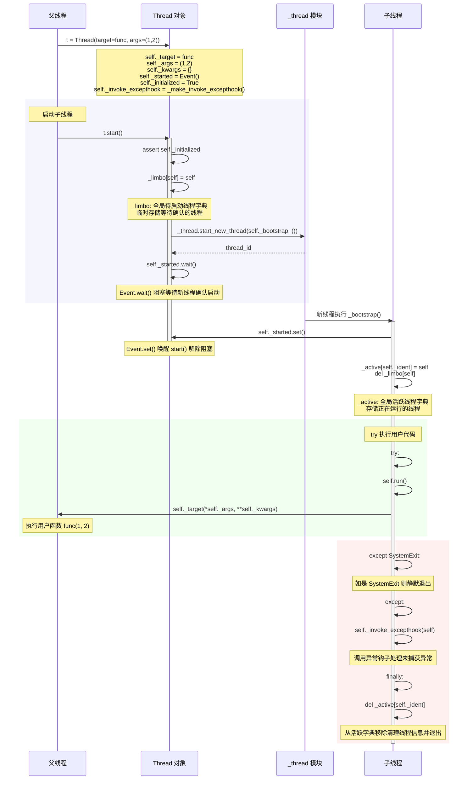
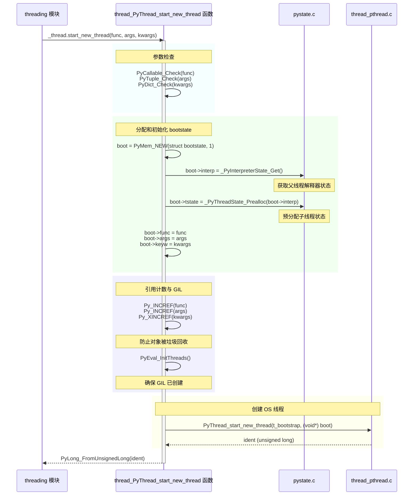
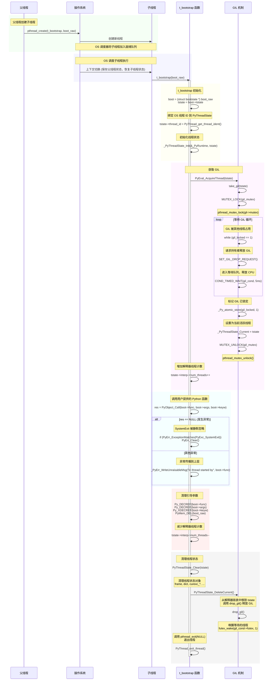

## 如何启动一个新线程？

下文将从各个层面逐层深入，详细了解线程启动的具体实现逻辑。

#### `threading` 层面实现

`threading` 层面通过 `start()` 方法启动线程。线程对象内维护 `_started` 事件用于判断当前线程是否已经启动，这是一个多线程共享的变量。父线程在 `start()` 方法的最后阶段会调用 `_started.wait()`，若子线程尚未启动，则父线程会进入阻塞状态等待子线程启动完成。`_initialized` 状态用于记录线程对象是否正常创建和初始化。

另外，`threading` 模块还负责管理全局的线程对象。进入 `start()` 后，父线程会将子线程对象先存入 `_limbo` 全局变量中，表示待启动的线程。然后等待操作系统为子线程分配资源，然后子线程将自己加入到 `_active` 全局变量中，并从 `_limbo` 中移除。`_limbo` 和 `_active` 都属于全局共享变量，所有的写操作都需要拿到 `_active_limbo_lock` 互斥锁。

`_thread` 模块中的 `_start_new_thread` 实现了子线程启动的具体逻辑，其第一个参数为子线程的执行函数，最顶层的函数定义在 `Thread._bootstrap(self)` 中，具体由 `Thread._bootstrap_inner(self)` 实现。这层封装采用模板方法模式实现，主要负责完成线程管理、用户代码接入和异常处理。

线程管理即根据线程所处状态维护 `threading` 模块中的 `_limbo` 和 `_active` 全局变量。用户代码接入即在子线程中调用 `target` 函数或覆盖后的 `Thread.run()` 方法。异常处理则依据 `excepthook` 的配置来输出或处理未捕获的异常，默认由 `sys.excepthook` 实现。



上述顺序图对应的具体代码实现如下，细节中包括上述未提及的 `daemon` 继承、异常回调配置 `_stderr` 和 `_invoke_excepthook` 等。此外，`_limbo` 是线程对象到线程对象的映射；而 `_active` 是 `ident`（操作系统分配的线程标识符）到线程对象的映射。`ident` 值由子线程在 `_bootstrap_inner` 中调用 `self._set_ident()` 获取并设置到 `self._ident` 变量。`_bootstrap_inner` 除上述三个功能外，还实现了 trace 钩子的配置，以支持 pdb 等调试功能。

```python
import _thread

_start_new_thread = _thread.start_new_thread

# Active thread administration
_active_limbo_lock = _allocate_lock()
_active = {}    # maps thread id to Thread object
_limbo = {}

class Thread:
    _initialized = False

    def __init__(self, group=None, target=None, name=None,
                 args=(), kwargs=None, *, daemon=None):
        assert group is None, "group argument must be None for now"
        if kwargs is None:
            kwargs = {}
        self._target = target
        self._name = str(name or _newname())
        self._args = args
        self._kwargs = kwargs
        if daemon is not None:
            self._daemonic = daemon
        else:
            self._daemonic = current_thread().daemon
        self._ident = None
        if _HAVE_THREAD_NATIVE_ID:
            self._native_id = None
        self._tstate_lock = None
        self._started = Event()
        self._is_stopped = False
        self._initialized = True
        # Copy of sys.stderr used by self._invoke_excepthook()
        self._stderr = _sys.stderr
        self._invoke_excepthook = _make_invoke_excepthook()
        # For debugging and _after_fork()
        _dangling.add(self)

    def start(self):
        """Start the thread's activity.

        It must be called at most once per thread object. It arranges for the
        object's run() method to be invoked in a separate thread of control.

        This method will raise a RuntimeError if called more than once on the
        same thread object.

        """
        if not self._initialized:
            raise RuntimeError("thread.__init__() not called")

        if self._started.is_set():
            raise RuntimeError("threads can only be started once")
        with _active_limbo_lock:
            _limbo[self] = self
        try:
            _start_new_thread(self._bootstrap, ())
        except Exception:
            with _active_limbo_lock:
                del _limbo[self]
            raise
        self._started.wait()

    def _bootstrap(self):
        # Wrapper around the real bootstrap code that ignores
        # exceptions during interpreter cleanup.  Those typically
        # happen when a daemon thread wakes up at an unfortunate
        # moment, finds the world around it destroyed, and raises some
        # random exception *** while trying to report the exception in
        # _bootstrap_inner() below ***.  Those random exceptions
        # don't help anybody, and they confuse users, so we suppress
        # them.  We suppress them only when it appears that the world
        # indeed has already been destroyed, so that exceptions in
        # _bootstrap_inner() during normal business hours are properly
        # reported.  Also, we only suppress them for daemonic threads;
        # if a non-daemonic encounters this, something else is wrong.
        try:
            self._bootstrap_inner()
        except:
            if self._daemonic and _sys is None:
                return
            raise

    def _bootstrap_inner(self):
        try:
            self._set_ident()
            self._set_tstate_lock()
            if _HAVE_THREAD_NATIVE_ID:
                self._set_native_id()
            self._started.set()
            with _active_limbo_lock:
                _active[self._ident] = self
                del _limbo[self]

            if _trace_hook:
                _sys.settrace(_trace_hook)
            if _profile_hook:
                _sys.setprofile(_profile_hook)

            try:
                self.run()
            except:
                self._invoke_excepthook(self)
        finally:
            with _active_limbo_lock:
                try:
                    # We don't call self._delete() because it also
                    # grabs _active_limbo_lock.
                    del _active[get_ident()]
                except:
                    pass
```

#### `_thread` 层面实现

从 `Thread.start(self)` 可以了解到，其本质是调用 `_thread.start_new_thread` 接口启动子线程，具体实现位于 `Modules/_threadmodule.c` 文件中。`start_new_thread` 的实现对应于 `thread_PyThread_start_new_thread(PyObject *self, PyObject *fargs)` 函数。

`thread_PyThread_start_new_thread` 会进一步将参数封装到 `struct bootstate` 结构中，以提供线程代码执行所需的环境，即解释器状态和线程状态。然后将此结构作为参数传递给 `t_bootstrap` 函数，并调用 `thread_pthread` 中的 `PyThread_start_new_thread` 接口创建线程，最后返回线程标识符。



具体实现如下，除模块及相关数据结构的定义外，算法流程与上述顺序图逐一对应。

```c
// Modules/_threadmodules.c

static PyMethodDef thread_methods[] = {
    {"start_new_thread",        (PyCFunction)thread_PyThread_start_new_thread,
     METH_VARARGS, start_new_doc},
    // 省略余下代码
}

static struct PyModuleDef threadmodule = {
    PyModuleDef_HEAD_INIT,
    "_thread",
    thread_doc,
    -1,
    thread_methods,
    NULL,
    NULL,
    NULL,
    NULL
};

struct bootstate {
    PyInterpreterState *interp;
    PyObject *func;
    PyObject *args;
    PyObject *keyw;
    PyThreadState *tstate;
};

static PyObject *
thread_PyThread_start_new_thread(PyObject *self, PyObject *fargs)
{
    // 参数解包和校验
    PyObject *func, *args, *keyw = NULL;
    struct bootstate *boot;
    unsigned long ident;
    
    // 从 tuple fargs 中解包 2 到 3 参数，分别赋值到 func, args, keyw 中
    // "start_new_thread" 仅用作错误信息打印
    if (!PyArg_UnpackTuple(fargs, "start_new_thread", 2, 3,
                           &func, &args, &keyw))
        return NULL;
    if (!PyCallable_Check(func)) {
        PyErr_SetString(PyExc_TypeError,
                        "first arg must be callable");
        return NULL;
    }
    if (!PyTuple_Check(args)) {
        PyErr_SetString(PyExc_TypeError,
                        "2nd arg must be a tuple");
        return NULL;
    }
    if (keyw != NULL && !PyDict_Check(keyw)) {
        PyErr_SetString(PyExc_TypeError,
                        "optional 3rd arg must be a dictionary");
        return NULL;
    }
    // 为 bootstate 分配内存
    boot = PyMem_NEW(struct bootstate, 1);
    if (boot == NULL)
        return PyErr_NoMemory();
    // 为子线程提供父线程的 Python 解释器环境
    boot->interp = _PyInterpreterState_Get();
    boot->func = func;
    boot->args = args;
    boot->keyw = keyw;
    // 初始化子线程状态
    boot->tstate = _PyThreadState_Prealloc(boot->interp);
    if (boot->tstate == NULL) {
        PyMem_DEL(boot);
        return PyErr_NoMemory();
    }
    Py_INCREF(func);
    Py_INCREF(args);
    Py_XINCREF(keyw);
    // 确保 GIL 已创建
    PyEval_InitThreads(); /* Start the interpreter's thread-awareness */
    ident = PyThread_start_new_thread(t_bootstrap, (void*) boot);
    if (ident == PYTHREAD_INVALID_THREAD_ID) {
        PyErr_SetString(ThreadError, "can't start new thread");
        Py_DECREF(func);
        Py_DECREF(args);
        Py_XDECREF(keyw);
        PyThreadState_Clear(boot->tstate);
        PyMem_DEL(boot);
        return NULL;
    }
    return PyLong_FromUnsignedLong(ident);
}
```

`t_bootstrap` 函数的执行细节如下：其主要负责获取 GIL，然后在给定的执行环境下调用 `struct bootstate` 中封装的函数。若出现非 `SystemExit` 的未捕获异常，则传播到调用层。执行结束后会清理线程对象。



对应的实现代码和依赖函数如下所示。

```c
// Modules/_threadmodule.c
static void
t_bootstrap(void *boot_raw)
{
    struct bootstate *boot = (struct bootstate *) boot_raw;
    PyThreadState *tstate;
    PyObject *res;

    tstate = boot->tstate;
    tstate->thread_id = PyThread_get_thread_ident();
    _PyThreadState_Init(&_PyRuntime, tstate);
    PyEval_AcquireThread(tstate);
    tstate->interp->num_threads++;
    res = PyObject_Call(boot->func, boot->args, boot->keyw);
    if (res == NULL) {
        if (PyErr_ExceptionMatches(PyExc_SystemExit))
            /* SystemExit is ignored silently */
            PyErr_Clear();
        else {
            _PyErr_WriteUnraisableMsg("in thread started by", boot->func);
        }
    }
    else {
        Py_DECREF(res);
    }
    Py_DECREF(boot->func);
    Py_DECREF(boot->args);
    Py_XDECREF(boot->keyw);
    PyMem_DEL(boot_raw);
    tstate->interp->num_threads--;
    PyThreadState_Clear(tstate);
    PyThreadState_DeleteCurrent();
    PyThread_exit_thread();
}

// Python/ceval.c
void
PyEval_AcquireThread(PyThreadState *tstate)
{
    if (tstate == NULL) {
        Py_FatalError("PyEval_AcquireThread: NULL new thread state");
    }

    _PyRuntimeState *runtime = &_PyRuntime;
    struct _ceval_runtime_state *ceval = &runtime->ceval;

    /* Check someone has called PyEval_InitThreads() to create the lock */
    assert(gil_created(&ceval->gil));
    take_gil(ceval, tstate);
    exit_thread_if_finalizing(runtime, tstate);
    if (_PyThreadState_Swap(&runtime->gilstate, tstate) != NULL) {
        Py_FatalError("PyEval_AcquireThread: non-NULL old thread state");
    }
}

// Python/ceval_gil.h
static void
take_gil(struct _ceval_runtime_state *ceval, PyThreadState *tstate)
{
    if (tstate == NULL) {
        Py_FatalError("take_gil: NULL tstate");
    }

    struct _gil_runtime_state *gil = &ceval->gil;
    int err = errno;
    MUTEX_LOCK(gil->mutex);

    if (!_Py_atomic_load_relaxed(&gil->locked)) {
        goto _ready;
    }

    while (_Py_atomic_load_relaxed(&gil->locked)) {
        int timed_out = 0;
        unsigned long saved_switchnum;

        saved_switchnum = gil->switch_number;


        unsigned long interval = (gil->interval >= 1 ? gil->interval : 1);
        COND_TIMED_WAIT(gil->cond, gil->mutex, interval, timed_out);
        /* If we timed out and no switch occurred in the meantime, it is time
           to ask the GIL-holding thread to drop it. */
        if (timed_out &&
            _Py_atomic_load_relaxed(&gil->locked) &&
            gil->switch_number == saved_switchnum)
        {
            SET_GIL_DROP_REQUEST(ceval);
        }
    }
_ready:
#ifdef FORCE_SWITCHING
    /* This mutex must be taken before modifying gil->last_holder:
       see drop_gil(). */
    MUTEX_LOCK(gil->switch_mutex);
#endif
    /* We now hold the GIL */
    _Py_atomic_store_relaxed(&gil->locked, 1);
    _Py_ANNOTATE_RWLOCK_ACQUIRED(&gil->locked, /*is_write=*/1);

    if (tstate != (PyThreadState*)_Py_atomic_load_relaxed(&gil->last_holder)) {
        _Py_atomic_store_relaxed(&gil->last_holder, (uintptr_t)tstate);
        ++gil->switch_number;
    }

#ifdef FORCE_SWITCHING
    COND_SIGNAL(gil->switch_cond);
    MUTEX_UNLOCK(gil->switch_mutex);
#endif
    if (_Py_atomic_load_relaxed(&ceval->gil_drop_request)) {
        RESET_GIL_DROP_REQUEST(ceval);
    }
    if (tstate->async_exc != NULL) {
        _PyEval_SignalAsyncExc(ceval);
    }

    MUTEX_UNLOCK(gil->mutex);
    errno = err;
}
```